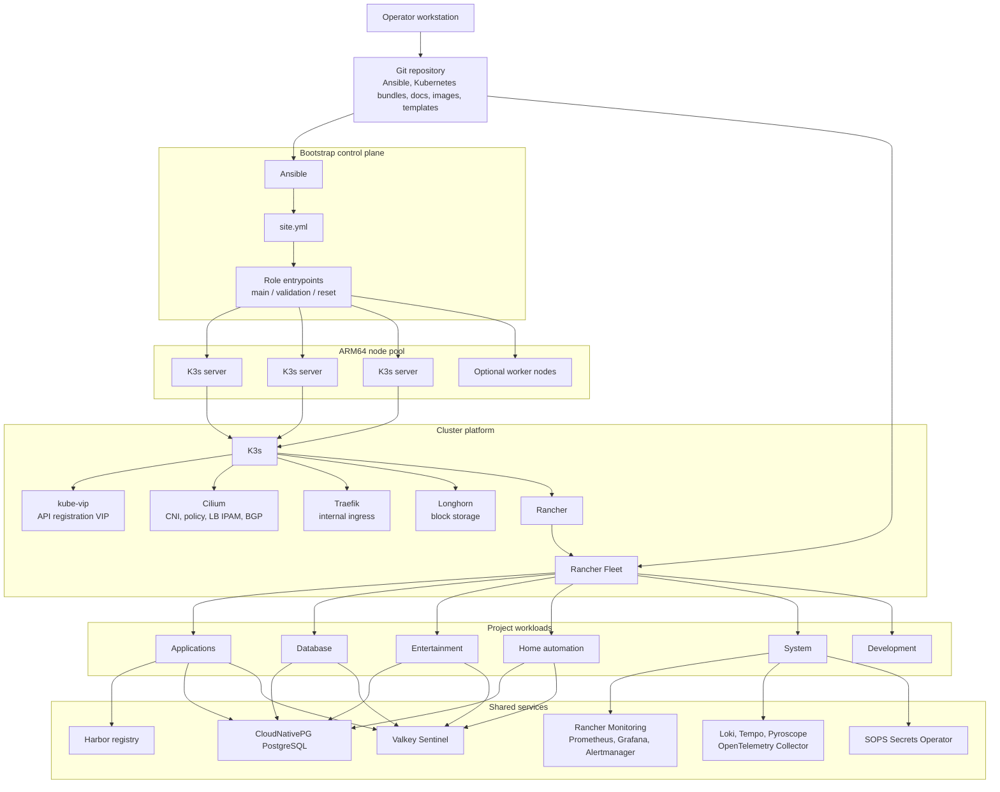
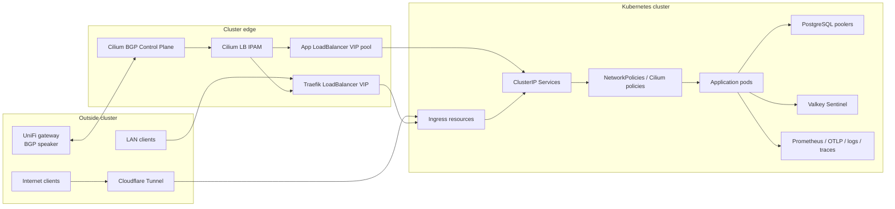

# Home Lab

An ARM64 Raspberry Pi home lab managed with Ansible, K3s, Cilium, Rancher
Fleet, Kubernetes manifests, custom container images, and Coder workspaces.

This repository documents the shape of a real self-hosted environment. It is
both the operating repo for the lab and a reference implementation for running
small-cluster GitOps on ARM64 hardware. It covers the complete path from bare
nodes to running applications: host preparation, cluster bootstrap, service
exposure, storage, databases, observability, application delivery, media
automation, home automation, and developer workspaces.

The repository is intentionally not a one-command installer. Hardware inventory,
router configuration, credentials, DNS zones, domain ownership, and other
site-specific values belong to the operator. The reusable value is the structure:
how the platform is layered, how responsibilities are separated, and how
applications are modeled as Git-managed bundles.

## Table of Contents

- [Why This Repository Exists](#why-this-repository-exists)
- [Design Goals](#design-goals)
- [Topology](#topology)
- [Traffic Model](#traffic-model)
- [North-South Traffic](#north-south-traffic)
- [East-West Traffic](#east-west-traffic)
- [Why Cilium](#why-cilium)
- [BGP and LoadBalancer VIPs](#bgp-and-loadbalancer-vips)
- [Repository Architecture](#repository-architecture)
- [Bootstrap Architecture](#bootstrap-architecture)
- [GitOps Architecture](#gitops-architecture)
- [Shared Platform Services](#shared-platform-services)
- [Self-Hosted Applications](#self-hosted-applications)
- [How Applications Are Coupled](#how-applications-are-coupled)
- [Storage Model](#storage-model)
- [Image and Registry Model](#image-and-registry-model)
- [Observability Model](#observability-model)
- [Developer Workspaces](#developer-workspaces)
- [Operational Workflow](#operational-workflow)
- [Validation](#validation)
- [Secrets and Local Configuration](#secrets-and-local-configuration)
- [Benefits](#benefits)
- [Tradeoffs](#tradeoffs)
- [Documentation Map](#documentation-map)
- [Conventions](#conventions)

## Why This Repository Exists

Most homelab examples stop at a list of services or a collection of manifests.
This repository is meant to show the connective tissue:

- how nodes become a K3s cluster;
- how the Kubernetes API remains reachable during bootstrap;
- how Cilium provides pod networking, NetworkPolicy, LoadBalancer IPAM, and BGP
  service advertisement;
- how Rancher Fleet turns app directories into independently reconciled GitOps
  bundles;
- how shared services such as PostgreSQL, Valkey, Harbor, Longhorn, Traefik,
  monitoring, and SOPS-backed secrets support the application layer;
- how public, internal, and in-cluster traffic take different paths;
- how ARM64 constraints affect chart selection, image building, storage, and
  scheduling choices.

The repo is useful if you want to understand how to operate a small Kubernetes
environment without flattening everything into one giant Helm release or one
manual cluster. It is also useful as a pattern library: the manifests show how
apps are split into namespaces, network policies, ingress, storage, secrets,
monitoring, and dependency bundles.

## Design Goals

The lab is built around a few explicit goals.

| Goal | What it means in this repo |
| --- | --- |
| Git as the source of truth | Intended cluster state lives in Git and is reconciled by Fleet. |
| Reproducible bootstrap | Ansible owns host prep, K3s configuration, platform add-ons, and validation. |
| Small-cluster pragmatism | The design accepts ARM64 and Raspberry Pi limits instead of pretending this is a cloud region. |
| Clear blast-radius boundaries | Rancher projects and app directories separate application, database, media, automation, and system concerns. |
| Explicit dependencies | Apps declare their database, cache, storage, ingress, image, secret, and monitoring assumptions in nearby files. |
| Internal-first operations | Most admin surfaces are internal-only; public exposure is deliberate and narrow. |
| Learnable layout | Each app bundle is readable without needing a separate deployment system or hidden generator. |

## Topology

The physical cluster is an ARM64 Raspberry Pi K3s environment. The logical
topology has two control planes:

- Ansible performs the bootstrap.
- Rancher Fleet reconciles post-bootstrap state from Git.



## Traffic Model

The cluster has two very different traffic paths.

- **North-south traffic** enters or leaves the cluster. Examples: a browser
  hitting an app, a public Cloudflare Tunnel request, a LAN client reaching
  `*.home`, image pulls from registries, app egress to APIs, DNS updates, and
  BGP advertisements to the gateway.
- **East-west traffic** stays inside the cluster. Examples: app pods reaching
  PostgreSQL poolers, Valkey Sentinel, service-to-service HTTP, Prometheus
  scrapes, OpenTelemetry export, and media apps sharing storage.

The repo models these paths separately because they have different reliability
and security needs. North-south traffic is about controlled exposure. East-west
traffic is about least-privilege service communication and predictable shared
dependencies.



## North-South Traffic

North-south traffic is handled through a small number of controlled entry
points.

### Internal LAN ingress

Internal web apps use Traefik and `Ingress` resources. Traefik runs in
`kube-system` as the bundled K3s ingress controller, but the repo overrides its
configuration through a `HelmChartConfig` generated by Ansible. The important
choices are:

- `type: LoadBalancer`;
- a Cilium load balancer class;
- a dedicated Traefik LoadBalancer IP;
- `externalTrafficPolicy: Local`;
- multiple Traefik replicas;
- pod anti-affinity and topology spread.

`externalTrafficPolicy: Local` matters because ingress traffic should land on a
node that actually has a local Traefik endpoint. That preserves client source
IP behavior and avoids an unnecessary cross-node service hop after traffic has
already reached the cluster.

### Public ingress

Public web apps are generally exposed through the Cloudflare Tunnel ingress
controller rather than by opening the home network directly. That pattern keeps
public HTTPS termination and edge protection outside the home gateway while the
in-cluster app still receives normal Kubernetes service traffic.

Examples include the portfolio, blog, GitRank, ShipyardHQ, Indexly, and Wardn
Hub. The app bundle usually owns:

- namespace and labels;
- deployment and service;
- public ingress;
- ConfigMap for non-secret runtime settings;
- SOPS-backed or manually managed Secret for credentials;
- image pull secret reference;
- network policy;
- optional jobs, workers, monitoring, and storage.

### Direct LoadBalancer services

Some workloads need a service VIP outside Traefik. qBittorrent is the clearest
example because torrent traffic uses TCP/UDP peer ports rather than normal HTTP
ingress. Those services draw from the app LoadBalancer pool and are advertised
to the LAN by Cilium BGP.

### Egress

Application egress is deliberately app-specific:

- media indexer traffic may use FlareSolverr or a controlled HTTP proxy;
- ExternalDNS talks to the UniFi DNS provider webhook;
- apps call public APIs such as GitHub, Clerk, Sanity, Cloudflare, or payment
  and finance integrations;
- image pulls use Harbor proxy/cache projects where possible.

NetworkPolicy files make those assumptions visible near each app.

## East-West Traffic

East-west traffic is the majority of cluster traffic. It is where most of the
coupling lives.

Common east-west paths:

| Source | Destination | Why |
| --- | --- | --- |
| Web apps | PostgreSQL poolers | Application persistence. |
| Web apps and workers | Valkey Sentinel | Queues, caches, BullMQ, and transient state. |
| Traefik | App services | Internal HTTP ingress. |
| Prometheus | ServiceMonitors and exporters | Metrics scraping. |
| Apps | OpenTelemetry Collector | OTLP metrics and traces. |
| Grafana | Prometheus, Loki, Tempo, Pyroscope | Observability queries. |
| Media apps | Shared media PVCs | Downloads, imports, metadata, and serving. |
| Fleet | Git repositories and image registries | Desired state sync and ImageScan. |

The repo treats these paths as first-class architecture. Database apps have
poolers and connection budgets. Media apps separate downloads from final media
storage. Monitoring apps expose ServiceMonitors and PrometheusRules. Network
policies describe who can talk to what.

This is why app directories include more than Deployments. A useful app bundle
needs the deployment plus its service, ingress, PVC, policy, runtime config,
secrets contract, monitoring, and dependency notes.

## Why Cilium

Cilium is used because it consolidates several cluster networking needs into
one system:

- Kubernetes CNI for pod networking;
- NetworkPolicy enforcement;
- LoadBalancer IP address management;
- BGP advertisement of service VIPs;
- Hubble visibility for network flow troubleshooting;
- ARM64-friendly operation on a small K3s cluster.

The alternative would be multiple components: one CNI, one NetworkPolicy
implementation, something like MetalLB for LoadBalancer IPs, and another system
for observability. Cilium reduces that split. The tradeoff is that Cilium is a
larger and more capable system, so its bootstrap and validation need to be
treated carefully.

The Ansible Cilium role installs the Cilium CLI, renders values, waits for the
local K3s API, installs or upgrades Cilium, restarts bootstrap add-ons after
the first install, and then applies the BGP and LoadBalancer IPAM resources
that make service exposure work.

## BGP and LoadBalancer VIPs

The cluster uses Cilium LB IPAM and Cilium BGP Control Plane for service
exposure on the LAN.

The model is:

1. Cilium allocates LoadBalancer IPs from declared pools.
2. Cilium BGP runs on the control-plane nodes.
3. The UniFi gateway peers with the K3s nodes.
4. Cilium advertises service VIPs as routes.
5. The gateway accepts only the expected service VIP prefixes.
6. LAN clients route to the service VIPs through the gateway.

There are two service exposure classes:

| VIP type | Purpose |
| --- | --- |
| Dedicated Traefik VIP | Stable ingress address for `*.home` HTTP services. |
| App LoadBalancer pool | Small pool for non-HTTP or app-specific LoadBalancer services. |

The BGP advertisement rules distinguish Traefik from other services:

- Traefik gets the dedicated ingress VIP.
- Other LoadBalancer services get addresses from the app pool.
- The router only accepts the expected VIPs or pool range.

This keeps service exposure explicit. A normal ClusterIP service stays internal.
An app only becomes LAN-routable when it asks for a LoadBalancer address from
the Cilium pool.

`kube-vip` has a different job: it supports the Kubernetes API registration VIP
used by K3s servers and agents. Cilium BGP is for service VIPs after the
network stack is running; kube-vip helps the cluster form and keep the API
endpoint stable.

## Repository Architecture

The repo is divided by responsibility rather than by tool alone.

| Area | Path | Responsibility |
| --- | --- | --- |
| Bootstrap | `infrastructure/ansible/` | Prepare hosts, install K3s, Cilium, Rancher, Longhorn, Fleet, and validation. |
| Kubernetes platform | `kubernetes/fleet/` and `kubernetes/projects/system/` | Fleet GitRepos, system controllers, monitoring, DNS, backup, compliance, logging, tracing. |
| Workload projects | `kubernetes/projects/<project>/apps/<app>/` | App bundles grouped by Rancher project. |
| Custom images | `kubernetes/images/` | Dockerfiles, patches, plugin lists, and image-specific documentation. |
| Developer workspaces | `coder/templates/` | Coder Terraform templates and shared workspace image layers. |
| Runbooks and ADRs | `docs/` | Operational procedures and design decisions that need more context than a manifest. |
| Scripts | `scripts/` | Small utilities used by operators or migration workflows. |

The main architectural rule is locality: files that explain or operate an app
should live next to the app. For example, an application directory can contain
its Deployment, Service, Ingress, NetworkPolicy, Fleet metadata, values,
CronJobs, PVCs, monitoring, and README. That makes the bundle reviewable as a
unit.

## Bootstrap Architecture

Ansible owns the base platform because the cluster cannot reconcile itself
until the API, networking, storage, Rancher, and Fleet exist.

Important bootstrap roles:

| Role | What it does |
| --- | --- |
| `os_prep` | Base operating-system preparation. |
| `rpi_prep` | Raspberry Pi-specific host setup and telemetry helpers. |
| `k3s_server` | K3s server configuration, secrets encryption, registry mirror settings, audit logging, and API arguments. |
| `k3s_agent` | K3s worker/agent configuration. |
| `kube_vip` | Kubernetes API registration VIP support. |
| `cilium` | CNI, NetworkPolicy, Hubble, LB IPAM, BGP, and Traefik LoadBalancer wiring. |
| `longhorn` | Distributed storage installation. |
| `cert_manager` | Certificate management bootstrap. |
| `rancher` | Rancher installation through K3s HelmChart. |
| `fleet_apps` | Fleet GitRepo bootstrap for the post-bootstrap app layer. |
| `smartctl_exporter` | Host-level S.M.A.R.T. metrics where container image support is not enough. |

Each role has validation tasks. This is important for infrastructure because
"the command ran" is not the same as "the cluster is usable." Validation checks
the resulting state after the role converges.

## GitOps Architecture

Rancher Fleet is the post-bootstrap reconciler. The repository uses multiple
Fleet `GitRepo` resources rather than one repo-wide bundle.

| GitRepo | Scope |
| --- | --- |
| `home-lab-rancher-projects` | Rancher project metadata under `kubernetes/projects/*/_project`. |
| `home-lab-system` | System services and cluster add-ons. |
| `home-lab-database` | PostgreSQL, Valkey, database operators, and database network policy. |
| `home-lab-applications` | Public and personal application workloads. |
| `home-lab-entertainment` | Media stack and supporting automation. |
| `home-lab-home-automation` | Home Assistant, NetBox, rack automation, UPS monitoring, and Cloudflare tunnel controller. |

This split has practical benefits:

- drift and failures are easier to isolate;
- ImageScan can be scoped per project;
- project directories can have different reconciliation force settings;
- app teams or future automation can reason about one project at a time;
- Rancher project metadata can be treated differently from application bundles.

## Shared Platform Services

These services are not just "apps"; they are the platform other apps depend on.

| Service | Project | Role in the lab |
| --- | --- | --- |
| Cilium | Bootstrap/system | Pod network, policy, LB IPAM, and BGP service advertisement. |
| Traefik | Bootstrap/system | Internal HTTP ingress for `*.home` style services. |
| Longhorn | Bootstrap/system | Persistent block storage for workloads and platform services. |
| Rancher | Bootstrap/system | Cluster management plane and Fleet host. |
| Fleet | Bootstrap/system | GitOps reconciliation engine. |
| CloudNativePG | Database | PostgreSQL operator and shared database cluster. |
| PostgreSQL | Database | Shared relational database with app-specific roles and poolers. |
| Valkey | Database | Shared cache/queue service with Sentinel. |
| Harbor | Applications | Local registry and proxy/cache layer for images. |
| Registry Artifacts | Applications | Controller for Harbor artifact discovery, retention, and mirroring. |
| SOPS Secrets Operator | System | Converts encrypted SOPS resources into native Kubernetes Secrets. |
| Rancher Monitoring | System | Prometheus, Grafana, Alertmanager, dashboards, and alert rules. |
| Loki | System | Log aggregation. |
| Tempo | System | Trace storage for OpenTelemetry traces. |
| Pyroscope | System | Continuous profiling backend. |
| OpenTelemetry Collector | System | OTLP metrics and trace ingestion path for applications. |
| ExternalDNS for UniFi | System | Reconciles internal DNS records from Kubernetes Ingress hosts. |

## Self-Hosted Applications

### Applications Project

| App | What it does | Notable dependencies |
| --- | --- | --- |
| Firefly III | Personal finance application. | PostgreSQL pooler, Longhorn upload PVC, internal Traefik ingress. |
| Firefly III Data Importer | Imports financial data into Firefly III. | Firefly service, Longhorn config PVC. |
| GitRank | Public GitHub/profile ranking app with frontend, API, webhooks, and workers. | PostgreSQL, Valkey, Harbor images, Cloudflare Tunnel. |
| Harbor | Local registry and proxy/cache registry. | PostgreSQL, Valkey, Longhorn storage, monitoring. |
| Indexly | Next.js application with Kubernetes CronJob replacements for scheduled work. | Harbor images, runtime secrets, Cloudflare Tunnel. |
| OpenBao | Lightweight secret-management experiment for the Wardn namespace. | Longhorn PVC, Traefik ingress. |
| Personal Blog | Public blog deployment. | Harbor image, Cloudflare Tunnel, Sanity revalidation secret. |
| Portfolio | Public portfolio deployment. | Harbor image, Cloudflare Tunnel. |
| Registry Artifacts | Controller for local Harbor artifact retention and mirroring. | Harbor API, PostgreSQL, GHCR credentials, local Traefik ingress. |
| ShipyardHQ | Public commerce/content application with web, worker, image proxy, and build jobs. | PostgreSQL, Valkey, R2, Harbor, Longhorn build cache, Cloudflare Tunnel. |
| Wardn Hub | Public AI/review platform with backend, frontend, workers, webhooks, and Codex login state. | PostgreSQL, OpenTelemetry, Harbor, Cloudflare Tunnel, Longhorn PVC. |

### Database Project

| App | What it does |
| --- | --- |
| CloudNativePG operator | Installs the PostgreSQL operator and CRDs. |
| PostgreSQL | Shared PostgreSQL cluster, roles, databases, poolers, query dashboards, and connection budgets. |
| Valkey | Shared Valkey replication and Sentinel for queues and caches. |
| Database network policies | Boundary policies for database access. |
| PostgreSQL pooler PDBs | Availability policy for app-specific poolers. |

### Entertainment Project

| App | What it does |
| --- | --- |
| qBittorrent | Torrent client with category paths and LoadBalancer peer port exposure. |
| Prowlarr | Indexer manager for media applications. |
| Sonarr | TV library management. |
| Radarr | Movie library management. |
| Ryokan | Anime request/import workflow. |
| Shoko | Anime metadata and library management for Jellyfin/Shokofin. |
| Jellyfin | Media server using custom image work and PostgreSQL-oriented experiments. |
| Jellyseerr / Seerr | Media request portal backed by Jellyfin. |
| MeTube | Browser UI for yt-dlp downloads into the YouTube media library. |
| Profilarr | Profile/configuration management for media apps. |
| Dispatcharr | Media dispatch and IPTV-related workflow. |
| FlareSolverr | Browser-challenge helper for selected indexers. |
| media-storage | Shared storage declarations, NAS-backed completed library, Longhorn downloads PVC, and keeper pod. |
| media-do-squid-firewall | Keeps a remote Squid proxy firewall allowlist aligned with current egress. |

The media stack is intentionally split between download storage and completed
library storage. Download clients write to a Longhorn downloads PVC. Importers
move completed content into the NAS-backed media library. Jellyfin scans the
completed library, not partial downloads.

### Home Automation Project

| App | What it does |
| --- | --- |
| Home Assistant | Home automation, packages from Git, HACS bootstrap, code-server sidecar. |
| NetBox | Source of truth for IPAM, device inventory, cabling, DNS, lifecycle, and BGP documentation. |
| Cloudflare Tunnel ingress controller | Maps Kubernetes ingress intent to Cloudflare Tunnel routes. |
| Rack Ops controllers | Rack/node automation, policy, monitoring, and guarded actions. |
| UPS Monitoring | Network UPS Tools, PeaNUT dashboard, exporter, Grafana dashboard, and alerts. |

### System Project

| App | What it does |
| --- | --- |
| Rancher Monitoring | Prometheus, Grafana, Alertmanager, dashboards, rules, and datasource provisioning. |
| Loki | Log storage and query backend. |
| Tempo | Trace backend for OpenTelemetry traces. |
| Pyroscope | Profiling backend. |
| OpenTelemetry Collector | Ingests OTLP metrics/traces and forwards them to Prometheus/Tempo. |
| ExternalDNS for UniFi | Creates internal DNS records from Traefik Ingress hosts. |
| Rancher Backup | Rancher backup operator and R2-backed backup configuration. |
| Rancher Compliance | Rancher Compliance operator. |
| Rancher Compliance Scans | One-time and monthly K3s CIS scan definitions. |
| Descheduler | Periodic workload rebalancing tuned for a small ARM64 cluster. |
| SOPS Secrets Operator | Decrypts encrypted SOPS resources into Kubernetes Secrets. |
| Longhorn recurring jobs | Filesystem trim and recurring storage maintenance hooks. |

## How Applications Are Coupled

The main coupling points are explicit and intentional.

### Database coupling

Applications do not each run their own database. The database project owns a
shared PostgreSQL cluster and app-specific roles, databases, and PgBouncer-style
poolers. Apps connect to their own pooler and use their own credentials.

This gives the lab one place to manage:

- PostgreSQL version and storage;
- backup and monitoring strategy;
- connection budgets;
- role/database lifecycle;
- query dashboards and performance analysis.

The tradeoff is that the database project becomes a critical shared dependency.
A bad database change can affect many apps, so pooler budgets, PDBs, monitoring,
and validation matter.

### Cache and queue coupling

Valkey is shared for app queues and cache-like workloads. Logical DB indexes
separate apps where needed. This avoids running a separate Redis/Valkey instance
for every app on small hardware, but it means noisy queue users need limits and
monitoring.

### Registry coupling

Harbor is the local image hub. Workloads can pull from local Harbor projects or
from Harbor proxy/cache projects such as Docker Hub and GHCR mirrors. This
reduces external registry dependency and makes ARM64 image choices visible.

The registry-artifacts controller manages parts of Harbor lifecycle behavior,
including artifact discovery, mirroring, and retention conventions.

### Ingress coupling

Internal apps share Traefik. Public apps usually use the Cloudflare Tunnel
ingress controller. This split keeps local-only admin apps simple while public
apps avoid direct home-router exposure.

### Observability coupling

Apps integrate with the system project through ServiceMonitors,
PrometheusRules, OpenTelemetry, logs, traces, and dashboards. Grafana is the
front door for the observability stack, with Prometheus, Loki, Tempo, and
Pyroscope as backing systems.

### Storage coupling

Longhorn is the default Kubernetes storage class for cluster-managed persistent
volumes. NAS-backed NFS storage is used where completed media library semantics
are more important than Kubernetes-local block storage.

### Secret coupling

Secrets are either encrypted in Git with SOPS patterns or created out of band
when the secret should not be owned by Fleet. App READMEs document required
runtime secrets so the contract is visible without committing values.

## Storage Model

The lab uses different storage patterns for different workloads.

| Storage type | Used for | Why |
| --- | --- | --- |
| Longhorn RWO/RWX PVCs | App data, build caches, monitoring, database volumes, Home Assistant config. | Kubernetes-native persistence with replication and Git-visible claims. |
| NAS NFS media library | Completed media content. | Large shared library semantics and direct media organization. |
| `emptyDir` | Ephemeral build output, local runtime cache, non-durable experiments. | Avoids unnecessary persistent write load. |
| Chart-managed PVCs with pinned details | Apps whose Helm charts manage PVCs. | Prevents Fleet from fighting immutable bound PVC fields. |

The storage design is pragmatic. PostgreSQL uses Longhorn-backed volumes with
CloudNativePG replication. Media downloads and completed media are separate.
Some observability systems start with small or non-durable storage until their
resource profile is known.

## Image and Registry Model

ARM64 support is a recurring design constraint. Some upstream images are not
published as ARM64 manifests or need plugins baked in. The repository therefore
keeps custom image definitions under `kubernetes/images/` and Coder image
definitions under `coder/templates/base/image/`.

Important image patterns:

- Harbor provides local registry and proxy/cache behavior.
- App workloads use namespace-scoped pull secrets for private Harbor projects.
- Public proxy-cache projects can be used for upstream images.
- Fleet ImageScan annotations let Fleet update selected image tags in Git.
- Custom images keep patches, plugin lists, and Dockerfiles reviewable.

This makes image supply explicit. The downside is that image build and registry
operations become part of the platform, not an afterthought.

## Observability Model

Observability is built into the system project and then extended by app bundles.

| Signal | System |
| --- | --- |
| Metrics | Rancher Monitoring Prometheus and ServiceMonitor resources. |
| Dashboards | Grafana dashboards from labeled ConfigMaps. |
| Alerts | PrometheusRules and AlertmanagerConfig resources. |
| Logs | Loki. |
| Traces | OpenTelemetry Collector and Tempo. |
| Profiles | Pyroscope. |
| Network flows | Cilium/Hubble where enabled. |
| Hardware health | node-exporter, Raspberry Pi throttling metrics, smartctl exporter, UPS exporter. |

The observability stack is intentionally local and modest. It aims to answer
operational questions for a small cluster: node pressure, storage health,
database performance, queue behavior, application traces, and whether a change
made the lab worse.

## Developer Workspaces

Coder templates provide Kubernetes-backed development environments on the same
ARM64 platform. Templates include Node.js, Python, NetBox plugin development,
and Ubuntu Desktop variants.

The templates are self-contained because `coder templates push -d` uploads only
the selected directory. Shared setup logic is maintained under
`coder/templates/_shared/` and vendored into each template.

The workspace design uses the same platform primitives as the rest of the lab:

- Kubernetes pods for workspaces;
- Longhorn-backed home storage;
- ARM64 base images;
- optional service sidecars such as PostgreSQL or Redis-style services;
- image build definitions tracked in Git.

## Operational Workflow

Typical change flow:

1. Edit the relevant role, app bundle, image, or template in Git.
2. Run the narrow validation that matches the change.
3. Commit and push.
4. Let Fleet reconcile Kubernetes state.
5. Use read-only inspection to diagnose convergence.
6. Encode fixes back into Git instead of mutating live resources by hand.

This workflow keeps the cluster understandable over time. Manual commands may
still be needed for break-glass repair or initial secret creation, but they
should not become the normal deployment mechanism.

## Validation

There is no package manager or single test runner at the repository root.
Validation is scoped to the subsystem being changed.

Ansible:

```sh
cd infrastructure/ansible
ansible-galaxy collection install -r collections/requirements.yml
ansible-playbook --syntax-check playbooks/site.yml
ansible-playbook playbooks/k3s_server.yml -e k3s_server_entrypoint=validation
```

Kubernetes:

```sh
kubectl apply --dry-run=server -f kubernetes/projects/<project>/apps/<app>/
```

Coder templates:

```sh
terraform -chdir=coder/templates/python-3-12 fmt -check
terraform -chdir=coder/templates/python-3-12 validate
```

Terraform validation requires provider initialization in the template directory.

## Secrets and Local Configuration

Do not commit plaintext secrets.

The repository structure expects the following to be environment-specific:

- Ansible inventory and host variables;
- SOPS and age identities;
- router-side BGP configuration;
- DNS provider credentials;
- application API keys;
- database passwords;
- image pull credentials;
- Cloudflare, GitHub, Sanity, Clerk, R2, and similar service tokens.

Runtime secrets are handled in two ways:

- encrypted SOPS resources where Fleet should own the resulting Kubernetes
  Secret;
- manually created Kubernetes Secrets where the application needs a value but
  Fleet should not own it.

App README files should document the required secret contract without storing
the value.

## Benefits

This design has concrete advantages:

- The cluster can be reasoned about from Git.
- App dependencies are visible near the app.
- Shared services reduce resource usage on small hardware.
- Cilium removes the need for separate CNI, policy, LoadBalancer IPAM, and BGP
  components.
- Fleet provides a clear reconciliation boundary without requiring a custom
  deployment tool.
- Rancher projects make ownership and policy boundaries visible.
- ARM64 image constraints are documented and solved in Git.
- Observability is treated as platform infrastructure, not a later add-on.

## Tradeoffs

The design also has costs:

- Shared PostgreSQL and Valkey are efficient, but they are important shared
  dependencies.
- Fleet drift correction is powerful, but immutable Kubernetes fields and
  chart-managed resources need careful handling.
- Cilium is capable, but it makes networking more complex than a default K3s
  flannel setup.
- BGP service advertisement is clean, but it requires router cooperation and
  careful prefix filtering.
- Longhorn is convenient, but storage IO and replica placement matter on small
  ARM64 nodes.
- Public and internal ingress are intentionally different paths, which adds
  mental overhead.
- Some secrets must remain manual or encrypted, so a public copy of the repo is
  a reference architecture rather than a complete runnable environment.

## Documentation Map

Start with the directory-level maps, then drill into project or app READMEs when
you need implementation detail.

| Document | Purpose |
| --- | --- |
| [coder/README.md](coder/README.md) | Coder workspace model and template ownership. |
| [coder/templates/README.md](coder/templates/README.md) | Coder template catalog, image flow, validation, and push commands. |
| [docs/README.md](docs/README.md) | Runbooks, architecture notes, and long-form operational docs. |
| [infrastructure/README.md](infrastructure/README.md) | Bootstrap, host configuration, networking, and source-of-truth tooling. |
| [infrastructure/ansible/README.md](infrastructure/ansible/README.md) | Ansible control plane, playbook flow, role entrypoints, and validation. |
| [infrastructure/ansible/inventories/README.md](infrastructure/ansible/inventories/README.md) | Inventory structure and environment-specific host/group data. |
| [infrastructure/ansible/playbooks/README.md](infrastructure/ansible/playbooks/README.md) | Playbook entrypoints and intended execution model. |
| [infrastructure/ansible/roles/README.md](infrastructure/ansible/roles/README.md) | Role conventions and bootstrap responsibilities. |
| [infrastructure/netbox/README.md](infrastructure/netbox/README.md) | NetBox source-of-truth workspace. |
| [infrastructure/network/README.md](infrastructure/network/README.md) | Network design notes and manual router-facing configuration areas. |
| [infrastructure/patches/README.md](infrastructure/patches/README.md) | Host and platform patch staging area. |
| [kubernetes/README.md](kubernetes/README.md) | Fleet and Kubernetes operating model. |
| [kubernetes/fleet/README.md](kubernetes/fleet/README.md) | Fleet control-plane bundles and GitRepo management. |
| [kubernetes/images/README.md](kubernetes/images/README.md) | Custom image build context and ARM64 image conventions. |
| [kubernetes/projects/README.md](kubernetes/projects/README.md) | Rancher project layout and project-level ownership. |
| [scripts/README.md](scripts/README.md) | Helper scripts and automation expectations. |

Project indexes:

| Document | Purpose |
| --- | --- |
| [kubernetes/projects/applications/README.md](kubernetes/projects/applications/README.md) | Public and internal application workloads. |
| [kubernetes/projects/database/README.md](kubernetes/projects/database/README.md) | PostgreSQL, Valkey, operators, pooling, and database contracts. |
| [kubernetes/projects/development/README.md](kubernetes/projects/development/README.md) | Developer services and workspace-adjacent apps. |
| [kubernetes/projects/entertainment/README.md](kubernetes/projects/entertainment/README.md) | Media stack, storage flow, and app coupling. |
| [kubernetes/projects/home-automation/README.md](kubernetes/projects/home-automation/README.md) | Home Assistant, NetBox, UPS, tunnels, and hardware-adjacent services. |
| [kubernetes/projects/system/README.md](kubernetes/projects/system/README.md) | Monitoring, logging, tracing, DNS, backup, and cluster add-ons. |

App and component deep dives:

| Document | Purpose |
| --- | --- |
| [coder/templates/netbox/README.md](coder/templates/netbox/README.md) | NetBox plugin development workspace. |
| [coder/templates/nodejs-22/README.md](coder/templates/nodejs-22/README.md) | Node.js 22 ARM64 Coder workspace. |
| [coder/templates/nodejs-24/README.md](coder/templates/nodejs-24/README.md) | Node.js 24 ARM64 Coder workspace. |
| [coder/templates/nodejs-26/README.md](coder/templates/nodejs-26/README.md) | Node.js 26 ARM64 Coder workspace. |
| [coder/templates/python-3-12/README.md](coder/templates/python-3-12/README.md) | Python 3.12 ARM64 Coder workspace. |
| [coder/templates/ubuntu-desktop/README.md](coder/templates/ubuntu-desktop/README.md) | Ubuntu desktop Coder workspace. |
| [kubernetes/fleet/fleet-gitjob-webhook/README.md](kubernetes/fleet/fleet-gitjob-webhook/README.md) | Fleet GitJob webhook integration. |
| [kubernetes/images/fleet/README.md](kubernetes/images/fleet/README.md) | Custom Fleet image context. |
| [kubernetes/images/jellyfin/README.md](kubernetes/images/jellyfin/README.md) | Custom Jellyfin image context. |
| [kubernetes/projects/applications/apps/firefly-iii/README.md](kubernetes/projects/applications/apps/firefly-iii/README.md) | Firefly III personal finance app. |
| [kubernetes/projects/applications/apps/firefly-iii-data-importer/README.md](kubernetes/projects/applications/apps/firefly-iii-data-importer/README.md) | Firefly III importer. |
| [kubernetes/projects/applications/apps/applications-helm-repositories/README.md](kubernetes/projects/applications/apps/applications-helm-repositories/README.md) | Application Helm repository registrations. |
| [kubernetes/projects/applications/apps/git-rank/README.md](kubernetes/projects/applications/apps/git-rank/README.md) | Git ranking application. |
| [kubernetes/projects/applications/apps/harbor/README.md](kubernetes/projects/applications/apps/harbor/README.md) | Harbor registry. |
| [kubernetes/projects/applications/apps/indexly/README.md](kubernetes/projects/applications/apps/indexly/README.md) | Indexly application. |
| [kubernetes/projects/applications/apps/openbao/README.md](kubernetes/projects/applications/apps/openbao/README.md) | OpenBao service. |
| [kubernetes/projects/applications/apps/personal-blog/README.md](kubernetes/projects/applications/apps/personal-blog/README.md) | Personal blog deployment. |
| [kubernetes/projects/applications/apps/portfolio/README.md](kubernetes/projects/applications/apps/portfolio/README.md) | Portfolio deployment. |
| [kubernetes/projects/applications/apps/registry-artifacts/README.md](kubernetes/projects/applications/apps/registry-artifacts/README.md) | Harbor artifact automation. |
| [kubernetes/projects/applications/apps/shipyardhq/README.md](kubernetes/projects/applications/apps/shipyardhq/README.md) | ShipyardHQ deployment. |
| [kubernetes/projects/applications/apps/wardn-hub/README.md](kubernetes/projects/applications/apps/wardn-hub/README.md) | Wardn Hub deployment. |
| [kubernetes/projects/database/apps/cnpg-operator/README.md](kubernetes/projects/database/apps/cnpg-operator/README.md) | CloudNativePG operator. |
| [kubernetes/projects/database/apps/database-helm-repositories/README.md](kubernetes/projects/database/apps/database-helm-repositories/README.md) | Database Helm repository registrations. |
| [kubernetes/projects/database/apps/postgresql/README.md](kubernetes/projects/database/apps/postgresql/README.md) | PostgreSQL cluster, roles, and poolers. |
| [kubernetes/projects/entertainment/apps/media-dispatcharr/README.md](kubernetes/projects/entertainment/apps/media-dispatcharr/README.md) | Dispatcharr media workflow. |
| [kubernetes/projects/entertainment/apps/media-do-squid-firewall/README.md](kubernetes/projects/entertainment/apps/media-do-squid-firewall/README.md) | Remote Squid allowlist automation. |
| [kubernetes/projects/entertainment/apps/media-helm-repositories/README.md](kubernetes/projects/entertainment/apps/media-helm-repositories/README.md) | Media Helm repository registrations. |
| [kubernetes/projects/entertainment/apps/media-jellyfin/README.md](kubernetes/projects/entertainment/apps/media-jellyfin/README.md) | Jellyfin media server. |
| [kubernetes/projects/entertainment/apps/media-metube/README.md](kubernetes/projects/entertainment/apps/media-metube/README.md) | MeTube download UI. |
| [kubernetes/projects/entertainment/apps/media-profilarr/README.md](kubernetes/projects/entertainment/apps/media-profilarr/README.md) | Profilarr media profile automation. |
| [kubernetes/projects/entertainment/apps/media-qbittorrent/README.md](kubernetes/projects/entertainment/apps/media-qbittorrent/README.md) | qBittorrent peer traffic and automation. |
| [kubernetes/projects/entertainment/apps/media-ryokan/README.md](kubernetes/projects/entertainment/apps/media-ryokan/README.md) | Ryokan anime workflow. |
| [kubernetes/projects/entertainment/apps/media-shoko/README.md](kubernetes/projects/entertainment/apps/media-shoko/README.md) | Shoko anime metadata workflow. |
| [kubernetes/projects/entertainment/apps/media-storage/README.md](kubernetes/projects/entertainment/apps/media-storage/README.md) | Media storage, libraries, and first-run wiring. |
| [kubernetes/projects/home-automation/apps/cloudflare-tunnel-ingress-controller/README.md](kubernetes/projects/home-automation/apps/cloudflare-tunnel-ingress-controller/README.md) | Cloudflare Tunnel ingress controller. |
| [kubernetes/projects/home-automation/apps/home-assistant/README.md](kubernetes/projects/home-automation/apps/home-assistant/README.md) | Home Assistant deployment. |
| [kubernetes/projects/home-automation/apps/home-automation-helm-repositories/README.md](kubernetes/projects/home-automation/apps/home-automation-helm-repositories/README.md) | Home automation Helm repository registrations. |
| [kubernetes/projects/home-automation/apps/netbox/README.md](kubernetes/projects/home-automation/apps/netbox/README.md) | NetBox application deployment. |
| [kubernetes/projects/home-automation/apps/ups-monitoring/README.md](kubernetes/projects/home-automation/apps/ups-monitoring/README.md) | UPS monitoring. |
| [kubernetes/projects/system/apps/descheduler/README.md](kubernetes/projects/system/apps/descheduler/README.md) | Descheduler policy. |
| [kubernetes/projects/system/apps/external-dns-unifi/README.md](kubernetes/projects/system/apps/external-dns-unifi/README.md) | ExternalDNS integration for UniFi DNS. |
| [kubernetes/projects/system/apps/opentelemetry-collector/README.md](kubernetes/projects/system/apps/opentelemetry-collector/README.md) | OpenTelemetry Collector. |
| [kubernetes/projects/system/apps/pyroscope/README.md](kubernetes/projects/system/apps/pyroscope/README.md) | Pyroscope profiling. |
| [kubernetes/projects/system/apps/rancher-backup/README.md](kubernetes/projects/system/apps/rancher-backup/README.md) | Rancher backup. |
| [kubernetes/projects/system/apps/rancher-compliance/README.md](kubernetes/projects/system/apps/rancher-compliance/README.md) | Rancher compliance operator. |
| [kubernetes/projects/system/apps/rancher-compliance-scans/README.md](kubernetes/projects/system/apps/rancher-compliance-scans/README.md) | Compliance scan definitions. |
| [kubernetes/projects/system/apps/rancher-monitoring/README.md](kubernetes/projects/system/apps/rancher-monitoring/README.md) | Rancher monitoring stack. |
| [kubernetes/projects/system/apps/sops-secrets-operator/README.md](kubernetes/projects/system/apps/sops-secrets-operator/README.md) | SOPS secrets operator. |
| [kubernetes/projects/system/apps/system-helm-repositories/README.md](kubernetes/projects/system/apps/system-helm-repositories/README.md) | System Helm repository registrations. |
| [kubernetes/projects/system/apps/tempo/README.md](kubernetes/projects/system/apps/tempo/README.md) | Tempo tracing backend. |

Runbooks and architecture decisions:

| Document | Purpose |
| --- | --- |
| [docs/architecture/adr-001-jellyfin-horizontal-scaling.md](docs/architecture/adr-001-jellyfin-horizontal-scaling.md) | Jellyfin horizontal scaling architecture decision. |
| [docs/runbooks/fleet-namespace-psa-labels.md](docs/runbooks/fleet-namespace-psa-labels.md) | Fleet namespace ownership and Pod Security Admission label rollout guidance. |
| [docs/runbooks/jellyfin-sqlite-to-postgresql-migration.md](docs/runbooks/jellyfin-sqlite-to-postgresql-migration.md) | Jellyfin SQLite-to-PostgreSQL migration rehearsal notes. |

## Conventions

- Use two-space YAML indentation and `---` document starts.
- Keep Kubernetes resource, app, and directory names lower-case kebab-case.
- Keep Ansible variables role-scoped, such as `k3s_server.*` or
  `fleet_apps_entrypoint`.
- Keep role task entrypoints consistent: `main`, `validation`, and `reset`.
- Keep Terraform formatted with `terraform fmt`.
- Prefer Git-managed cluster changes over live `kubectl` or `helm` mutation.
- Do not revert unrelated local changes when working in this repository.
