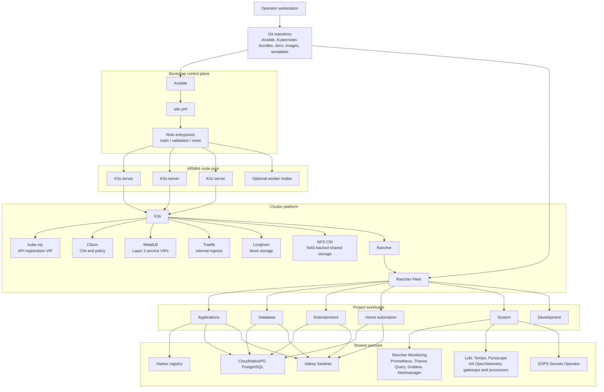
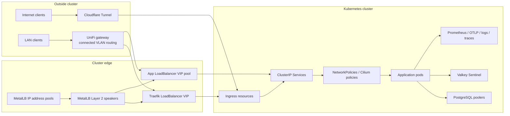

<div align="center">

<h1>home-lab - an ARM64 Raspberry Pi GitOps homelab</h1>
<p><em>... managed with
<a href="infrastructure/ansible/README.md">Ansible</a>,
<a href="kubernetes/fleet/README.md">Rancher Fleet</a>,
<a href="kubernetes/projects/applications/apps/renovate/README.md">Renovate</a>
and <a href=".pre-commit-config.yaml">pre-commit</a></em></p>

<p>
  
  
  
</p>

<p>
  
  
  
  
  
  
</p>

<p>
  
  
  
  
</p>

</div>

An ARM64 Raspberry Pi home lab managed with Ansible, K3s, Cilium, Rancher
Fleet, Kubernetes manifests, custom container images, and Coder workspaces.

This repository documents the shape of a real self-hosted environment. It is
both the operating repo for the lab and a reference implementation for running
small-cluster GitOps on ARM64 hardware. It covers the complete path from bare
nodes to running applications: host preparation, cluster bootstrap, service
exposure, storage, databases, observability, application delivery, media
automation, home automation, and developer workspaces.

The repository is intentionally not a one-command installer. Hardware inventory,
router configuration, credentials, DNS zones, domain ownership, and other
site-specific values belong to the operator. The reusable value is the structure:
how the platform is layered, how responsibilities are separated, and how
applications are modeled as Git-managed bundles.

## At A Glance

| Area | Current shape |
| --- | --- |
| Hardware | Eight ARM64 Raspberry Pi nodes: three K3s servers and five workers. |
| Kubernetes | K3s `v1.35.8+k3s1` with embedded etcd and a kube-vip API registration VIP. |
| Bootstrap | Ansible prepares hosts, configures K3s, installs Cilium, Longhorn, Rancher, and Fleet. |
| GitOps | Rancher Fleet reconciles one GitRepo per major project boundary. |
| Networking | Cilium `1.20.1` provides CNI, kube-proxy replacement, and NetworkPolicy; MetalLB `0.16.1` provides Layer 2 service VIPs. |
| Ingress | Traefik handles internal `*.home` ingress; Cloudflare Tunnel handles selected public ingress, including a capability-scoped Home Assistant mobile sensor gateway. |
| Storage | Longhorn is the default block-storage layer; selected file workloads use retained, per-PVC directories on NAS-backed NFS CSI storage. |
| Data services | CloudNativePG PostgreSQL and Valkey Sentinel provide shared app data dependencies. |
| Registry | Harbor acts as the local registry and proxy/cache for external image registries. |
| Secrets | SOPS/age covers Git-managed secrets; selected runtime secrets stay manually created. |
| Observability | Rancher Monitoring, two-replica Thanos Query, Grafana, Loki, Tempo, Pyroscope, two-tier HA OpenTelemetry, and hardware exporters. |
| Workspaces | Coder templates provide ARM64 Node.js, Python, NetBox, and Ubuntu Desktop environments. |

## Hardware Details

The Kubernetes node pool is intentionally homogeneous: eight Raspberry Pi 5 Model
B systems with local NVMe storage and wired Ethernet. Serial numbers, MAC
addresses, cabling, procurement, and lifecycle metadata belong in NetBox or
private inventory rather than the public README.

| Node | Board | CPU | Memory | Local storage | Network |
| --- | --- | --- | --- | --- | --- |
| `k8s-rpi1` | Raspberry Pi 5 Model B Rev 1.1 | 4-core ARM64 | 15.8 GiB | WD Green SN350 500GB NVMe, ext4 root, Longhorn data path | 1 GbE |
| `k8s-rpi2` | Raspberry Pi 5 Model B Rev 1.1 | 4-core ARM64 | 15.8 GiB | WD Green SN350 500GB NVMe, ext4 root, Longhorn data path | 1 GbE |
| `k8s-rpi3` | Raspberry Pi 5 Model B Rev 1.1 | 4-core ARM64 | 15.8 GiB | WD Green SN350 500GB NVMe, ext4 root, Longhorn data path | 1 GbE |
| `k8s-rpi4` | Raspberry Pi 5 Model B Rev 1.1 | 4-core ARM64 | 15.8 GiB | WD Green SN350 500GB NVMe, ext4 root, Longhorn data path | 1 GbE |
| `k8s-rpi5` | Raspberry Pi 5 Model B Rev 1.1 | 4-core ARM64 | 15.8 GiB | WD Blue SN5100 500GB NVMe, ext4 root, Longhorn data path | 1 GbE |
| `k8s-rpi6` | Raspberry Pi 5 Model B Rev 1.1 | 4-core ARM64 | 15.8 GiB | WD Blue SN5100 500GB NVMe, ext4 root, Longhorn data path | 1 GbE |
| `k8s-rpi7` | Raspberry Pi 5 Model B Rev 1.1 | 4-core ARM64 | 15.8 GiB | WD Blue SN5100 500GB NVMe, ext4 root, Longhorn data path | 1 GbE |
| `k8s-rpi8` | Raspberry Pi 5 Model B Rev 1.1 | 4-core ARM64 | 15.8 GiB | WD Blue SN5100 500GB NVMe, ext4 root, Longhorn data path | 1 GbE |

Aggregate hardware capacity:

| Resource | Capacity |
| --- | --- |
| CPU | 32 ARM64 cores across eight nodes. |
| Memory | 126.4 GiB reported total memory across eight nodes. |
| Local NVMe | 8 x 500GB NVMe devices, about 3.6 TiB usable before Longhorn replication and filesystem overhead. |

## External Dependencies

The lab is self-hosted where it matters operationally, but it still relies on a
small set of external systems for source control, public ingress, certificates,
and selected application integrations.

| Dependency | Used for | Git-managed surface |
| --- | --- | --- |
| GitHub | Repository hosting, image automation, GHCR image sources, app webhooks. | Workflows, manifests, Renovate metadata, Harbor proxy paths. |
| Cloudflare | Public tunnel ingress, DNS automation for public routes, DNS01 certificate solving, R2-backed app storage. | Tunnel ingress class, cert-manager issuer configuration, app secret contracts. |
| Let's Encrypt | Public TLS certificates through cert-manager ACME. | cert-manager ClusterIssuer settings. |
| UniFi gateway | LAN routing, internal DNS, mDNS reflection, and scoped cross-VLAN player control. | ExternalDNS UniFi app plus VLAN and firewall notes; Kubernetes VIPs use ordinary connected-VLAN routing, while Music Assistant has a least-privilege Google Cast policy. |
| NAS | NFS exports for media plus retained per-PVC shared application storage. | Static media PVs, the `nfs-shared-retain` StorageClass, application claims, and storage runbooks. |
| External registries | Upstream images from Docker Hub, GHCR, OCI registries, and vendor registries. | Harbor proxy/cache paths and Renovate update comments. |
| App SaaS APIs | App-specific integrations such as GitHub, Clerk, Sanity, payment APIs, and similar services. | Per-app manifests and README secret contracts. |
| Last.fm | Catalog-level recommendations for Music Assistant radio. | Music Assistant provider configuration and SOPS-managed application key. |
| YouTube / YouTube Music | Authenticated account discovery, radio, playback, and persistent local caching through Music Assistant. | Hash-pinned Music Assistant provider, encrypted SOPS-fed cookie configuration, PostgreSQL account/cache catalog, and documented unofficial-API boundaries. |

## Common Commands

Install and run the repository validation hooks before committing. The Linux
bootstrap uses `uv` for the pinned Python tools, installs checksum-verified
validator binaries, and configures the Git hook. The hooks operate only on
repository files and do not mutate the live cluster.

```sh
scripts/setup-pre-commit.sh
pre-commit run --all-files
```

The bootstrap requires `uv`, Terraform, ShellCheck, `curl`, and standard archive
tools. It installs the remaining pinned tools in
`${UV_TOOL_BIN_DIR:-$HOME/.local/bin}`.

Run narrower validation from the subsystem you are changing when needed.

Ansible bootstrap checks:

```sh
cd infrastructure/ansible
ansible-galaxy collection install -r collections/requirements.yml
ansible-playbook --syntax-check playbooks/site.yml
ansible-playbook playbooks/k3s_server.yml -e k3s_server_entrypoint=validation
```

Kubernetes bundle dry run:

```sh
kubectl apply --dry-run=server -f kubernetes/projects/<project>/apps/<app>/
```

NetBox workload catalog validation:

```sh
python -m pip install --requirement .github/requirements/workload-catalog.txt
python scripts/validate-workload-catalog.py
```

Coder template checks:

```sh
terraform -chdir=coder/templates/python-3-12 fmt -check
terraform -chdir=coder/templates/python-3-12 init -backend=false
terraform -chdir=coder/templates/python-3-12 validate
```

README version badge sync:

```sh
scripts/sync-readme-versions.py --check
scripts/sync-readme-versions.py --update
```

## Table of Contents

- [At A Glance](#at-a-glance)
- [Hardware Details](#hardware-details)
- [External Dependencies](#external-dependencies)
- [Common Commands](#common-commands)
- [Why This Repository Exists](#why-this-repository-exists)
- [Design Goals](#design-goals)
- [Topology](#topology)
- [Traffic Model](#traffic-model)
- [North-South Traffic](#north-south-traffic)
- [East-West Traffic](#east-west-traffic)
- [Why Cilium](#why-cilium)
- [Layer 2 LoadBalancer VIPs](#layer-2-loadbalancer-vips)
- [Repository Architecture](#repository-architecture)
- [Bootstrap Architecture](#bootstrap-architecture)
- [GitOps Architecture](#gitops-architecture)
- [Shared Platform Services](#shared-platform-services)
- [Self-Hosted Applications](#self-hosted-applications)
- [How Applications Are Coupled](#how-applications-are-coupled)
- [Storage Model](#storage-model)
- [Image and Registry Model](#image-and-registry-model)
- [Observability Model](#observability-model)
- [Developer Workspaces](#developer-workspaces)
- [Operational Workflow](#operational-workflow)
- [Validation](#validation)
- [Secrets and Local Configuration](#secrets-and-local-configuration)
- [Benefits](#benefits)
- [Tradeoffs](#tradeoffs)
- [Documentation Map](#documentation-map)
- [Conventions](#conventions)

## Why This Repository Exists

Most homelab examples stop at a list of services or a collection of manifests.
This repository is meant to show the connective tissue:

- how nodes become a K3s cluster;
- how the Kubernetes API remains reachable during bootstrap;
- how Cilium provides pod networking and NetworkPolicy while MetalLB provides
  LAN service VIP allocation and Layer 2 advertisement;
- how Rancher Fleet turns app directories into independently reconciled GitOps
  bundles;
- how shared services such as PostgreSQL, Valkey, Harbor, Longhorn, Traefik,
  monitoring, and SOPS-backed secrets support the application layer;
- how public, internal, and in-cluster traffic take different paths;
- how ARM64 constraints affect chart selection, image building, storage, and
  scheduling choices.

The repo is useful if you want to understand how to operate a small Kubernetes
environment without flattening everything into one giant Helm release or one
manual cluster. It is also useful as a pattern library: the manifests show how
apps are split into namespaces, network policies, ingress, storage, secrets,
monitoring, and dependency bundles.

## Design Goals

The lab is built around a few explicit goals.

| Goal | What it means in this repo |
| --- | --- |
| Git as the source of truth | Intended cluster state lives in Git and is reconciled by Fleet. |
| Reproducible bootstrap | Ansible owns host prep, K3s configuration, platform add-ons, and validation. |
| Small-cluster pragmatism | The design accepts ARM64 and Raspberry Pi limits instead of pretending this is a cloud region. |
| Clear blast-radius boundaries | Rancher projects and app directories separate application, database, media, automation, and system concerns. |
| Explicit dependencies | Apps declare their database, cache, storage, ingress, image, secret, and monitoring assumptions in nearby files. |
| Internal-first operations | Most admin surfaces are internal-only; public exposure is deliberate and narrow. |
| Learnable layout | Each app bundle is readable without needing a separate deployment system or hidden generator. |

## Topology

The physical cluster is an ARM64 Raspberry Pi K3s environment. The logical
topology has two control planes:

- Ansible performs the bootstrap.
- Rancher Fleet reconciles post-bootstrap state from Git.


```mermaid
flowchart TD
  operator["Operator workstation"]
  repo["Git repository<br/>Ansible, Kubernetes bundles, docs, images, templates"]

  subgraph bootstrap["Bootstrap control plane"]
    ansible["Ansible"]
    site["site.yml"]
    roles["Role entrypoints<br/>main / validation / reset"]
  end

  subgraph nodes["ARM64 node pool"]
    server1["K3s server"]
    server2["K3s server"]
    server3["K3s server"]
    workers["Optional worker nodes"]
  end

  subgraph platform["Cluster platform"]
    k3s["K3s"]
    kubevip["kube-vip<br/>API registration VIP"]
    cilium["Cilium<br/>CNI and policy"]
    metallb["MetalLB<br/>Layer 2 service VIPs"]
    traefik["Traefik<br/>internal ingress"]
    longhorn["Longhorn<br/>block storage"]
    nfscsi["NFS CSI<br/>NAS-backed shared storage"]
    rancher["Rancher"]
    fleet["Rancher Fleet"]
  end

  subgraph shared["Shared services"]
    postgres["CloudNativePG PostgreSQL"]
    valkey["Valkey Sentinel"]
    harbor["Harbor registry"]
    monitoring["Rancher Monitoring<br/>Prometheus, Thanos Query, Grafana, Alertmanager"]
    telemetry["Loki, Tempo, Pyroscope<br/>HA OpenTelemetry gateways and processors"]
    secrets["SOPS Secrets Operator"]
  end

  subgraph apps["Project workloads"]
    appProject["Applications"]
    dbProject["Database"]
    mediaProject["Entertainment"]
    homeProject["Home automation"]
    systemProject["System"]
    devProject["Development"]
  end

  operator --> repo
  repo --> ansible
  ansible --> site
  site --> roles
  roles --> server1
  roles --> server2
  roles --> server3
  roles --> workers

  server1 --> k3s
  server2 --> k3s
  server3 --> k3s
  k3s --> kubevip
  k3s --> cilium
  k3s --> metallb
  k3s --> traefik
  k3s --> longhorn
  k3s --> nfscsi
  k3s --> rancher
  rancher --> fleet

  repo --> fleet
  fleet --> appProject
  fleet --> dbProject
  fleet --> mediaProject
  fleet --> homeProject
  fleet --> systemProject
  fleet --> devProject

  dbProject --> postgres
  dbProject --> valkey
  appProject --> harbor
  systemProject --> monitoring
  systemProject --> telemetry
  systemProject --> secrets

  appProject --> postgres
  appProject --> valkey
  mediaProject --> postgres
  mediaProject --> valkey
  homeProject --> postgres
  homeProject --> valkey
```

The three K3s servers carry the standard
`node-role.kubernetes.io/control-plane=true` label and the declarative
`CriticalAddonsOnly=true:NoExecute` taint. Platform controllers and
observability backends select that label and tolerate the taint. Node-local
network, storage, and exporter DaemonSets tolerate it without being pinned.
Ordinary application workloads have no critical toleration, so they schedule
on the five untainted workers without a custom node-pool label.

## Traffic Model

The cluster has two very different traffic paths.

- **North-south traffic** enters or leaves the cluster. Examples: a browser
  hitting an app, a public Cloudflare Tunnel request, a LAN client reaching
  `*.home`, image pulls from registries, app egress to APIs, DNS updates, and
  Layer 2 service VIP advertisements on the cluster VLAN.
- **East-west traffic** stays inside the cluster. Examples: app pods reaching
  PostgreSQL poolers, Valkey Sentinel, service-to-service HTTP, Prometheus
  scrapes, OpenTelemetry export, and media apps sharing storage.

The repo models these paths separately because they have different reliability
and security needs. North-south traffic is about controlled exposure. East-west
traffic is about least-privilege service communication and predictable shared
dependencies.


```mermaid
flowchart LR
  subgraph outside["Outside cluster"]
    internet["Internet clients"]
    cloudflare["Cloudflare Tunnel"]
    lan["LAN clients"]
    gateway["UniFi gateway<br/>connected VLAN routing"]
  end

  subgraph edge["Cluster edge"]
    speakers["MetalLB Layer 2 speakers"]
    lbipam["MetalLB IP address pools"]
    traefik["Traefik LoadBalancer VIP"]
    appVIPs["App LoadBalancer VIP pool"]
  end

  subgraph cluster["Kubernetes cluster"]
    ingress["Ingress resources"]
    services["ClusterIP Services"]
    policies["NetworkPolicies / Cilium policies"]
    pods["Application pods"]
    postgres["PostgreSQL poolers"]
    valkey["Valkey Sentinel"]
    monitoring["Prometheus / OTLP / logs / traces"]
  end

  internet --> cloudflare
  cloudflare --> ingress
  lan --> gateway
  gateway --> traefik
  gateway --> appVIPs
  lbipam --> speakers
  speakers --> traefik
  speakers --> appVIPs
  appVIPs --> services
  traefik --> ingress
  ingress --> services
  services --> policies
  policies --> pods
  pods --> postgres
  pods --> valkey
  pods --> monitoring
```

## North-South Traffic

North-south traffic is handled through a small number of controlled entry
points.

### Internal LAN ingress

Internal web apps use Traefik and `Ingress` resources. Traefik runs in
`kube-system` as the bundled K3s ingress controller, but the repo overrides its
configuration through a `HelmChartConfig` generated by Ansible. The important
choices are:

- `type: LoadBalancer`;
- an explicit MetalLB address-pool annotation;
- the dedicated `192.168.3.3` Traefik LoadBalancer IP;
- `externalTrafficPolicy: Local`;
- multiple Traefik replicas;
- pod anti-affinity and topology spread.

`externalTrafficPolicy: Local` matters because ingress traffic should land on a
node that actually has a local Traefik endpoint. That preserves client source
IP behavior and avoids an unnecessary cross-node service hop after traffic has
already reached the cluster.

### Public ingress

Public web apps are generally exposed through the Cloudflare Tunnel ingress
controller rather than by opening the home network directly. That pattern keeps
public HTTPS termination and edge protection outside the home gateway while the
in-cluster app still receives normal Kubernetes service traffic.

Examples include the portfolio, blog, ShipyardHQ, and Wardn Hub. The
app bundle usually owns:

- namespace and labels;
- deployment and service;
- public ingress;
- ConfigMap for non-secret runtime settings;
- SOPS-backed or manually managed Secret for credentials;
- image pull secret reference;
- network policy;
- optional jobs, workers, monitoring, and storage.

### Direct LoadBalancer services

Some workloads need a service VIP outside Traefik. qBittorrent is the clearest
example because torrent traffic uses TCP/UDP peer ports rather than normal HTTP
ingress. Those services request fixed addresses from the MetalLB app pool and
are advertised to the LAN by ARP. qBittorrent's static-IP WAN exposure is a
router port forward for TCP/UDP `53181` to `192.168.3.16` only; the WebUI/API
stays on LAN/VPN paths.

### Egress

Application egress is deliberately app-specific:

- media indexer traffic goes direct by default and may use FlareSolverr for
  browser-challenge handling;
- ExternalDNS talks to the UniFi DNS provider webhook;
- apps call public APIs such as GitHub, Clerk, Sanity, Cloudflare, or payment
  and finance integrations;
- image pulls use Harbor proxy/cache projects where possible.

NetworkPolicy files make those assumptions visible near each app.

## East-West Traffic

East-west traffic is the majority of cluster traffic. It is where most of the
coupling lives.

Common east-west paths:

| Source | Destination | Why |
| --- | --- | --- |
| Web apps | PostgreSQL poolers | Application persistence. |
| Web apps and workers | Valkey Sentinel | Queues, caches, BullMQ, and transient state. |
| Traefik | App services | Internal HTTP ingress. |
| Prometheus | ServiceMonitors and exporters | Metrics scraping. |
| Apps | OpenTelemetry Collector | OTLP metrics and traces. |
| Grafana | Thanos Query, Loki, Tempo, Pyroscope | Observability queries. |
| Media apps | Shared media PVCs | Downloads, imports, metadata, and serving. |
| Fleet | Git repositories | Desired state sync. |
| Renovate | Git repositories and image registries | Container image update commits. |

The repo treats these paths as first-class architecture. Database apps have
poolers and connection budgets. Media apps separate downloads from final media
storage. Monitoring apps expose ServiceMonitors and PrometheusRules. Network
policies describe who can talk to what.

This is why app directories include more than Deployments. A useful app bundle
needs the deployment plus its service, ingress, PVC, policy, runtime config,
secrets contract, monitoring, and dependency notes.

## Why Cilium

Cilium is used because it consolidates several cluster networking needs into
one system:

- Kubernetes CNI for pod networking;
- NetworkPolicy enforcement;
- Hubble visibility for network flow troubleshooting;
- ARM64-friendly operation on a small K3s cluster.

MetalLB deliberately owns LAN service exposure separately. That adds a small
component boundary while keeping Kubernetes VIP ownership inside the cluster
and independent of WAN state. Cilium remains the pod dataplane and policy
engine.

The Ansible Cilium role installs the Cilium CLI, renders values, waits for the
local K3s API, installs or upgrades Cilium, restarts bootstrap add-ons after
the first install, configures bundled Traefik, and validates its MetalLB VIP.

## Layer 2 LoadBalancer VIPs

The cluster uses MetalLB address pools and Layer 2 advertisements for service
exposure on the LAN.

The model is:

1. A Service explicitly requests an address from a declared MetalLB pool.
2. MetalLB selects an eligible speaker for the VIP.
3. That node answers ARP for the VIP on its physical `eth0` interface.
4. The UniFi gateway uses ordinary connected-VLAN routing.
5. LAN clients reach the VIP through ordinary connected-VLAN routing,
   independent of WAN state.

There are two service exposure classes:

| VIP type | Purpose |
| --- | --- |
| Dedicated Traefik VIP | Stable ingress address for `*.home` HTTP services. |
| App LoadBalancer pool | Small pool for non-HTTP or app-specific LoadBalancer services. |

Network anchors:

| Purpose | Address or range | Owner |
| --- | --- | --- |
| K3s API registration VIP | `192.168.3.2` | kube-vip |
| Internal Traefik LoadBalancer VIP | `192.168.3.3` | MetalLB `ingress-services` pool |
| App LoadBalancer service pool | `192.168.3.16-192.168.3.23` | MetalLB `app-services` pool |
| Cluster VLAN gateway | `192.168.3.1` | UniFi gateway |

The address pools distinguish Traefik from other services:

- Traefik gets the dedicated ingress VIP.
- App-specific LoadBalancer services request addresses from the app pool.
- Automatic allocation is disabled, so unrelated Services cannot consume a LAN
  VIP silently.

This keeps service exposure explicit. A normal ClusterIP service stays internal.
An app only becomes LAN-routable when it asks for a LoadBalancer address from
the MetalLB pool.

`kube-vip` has a different job: it supports the Kubernetes API registration VIP
used by K3s servers and agents. Each host-networked kube-vip replica uses the
K3s API on its own control-plane node, so leader election does not depend on the
VIP or one physical server. MetalLB handles application service VIPs after the
network stack is running; kube-vip helps the cluster form and keep the API
endpoint stable.

## Repository Architecture

The repo is divided by responsibility rather than by tool alone.

| Area | Path | Responsibility |
| --- | --- | --- |
| Bootstrap | `infrastructure/ansible/` | Prepare hosts, install K3s, Cilium, Rancher, Longhorn, Fleet, and validation. |
| Kubernetes platform | `kubernetes/fleet/` and `kubernetes/projects/system/` | Fleet GitRepos, system controllers, monitoring, DNS, backup, compliance, logging, tracing. |
| Workload projects | `kubernetes/projects/<project>/apps/<app>/` | App bundles grouped by Rancher project. |
| Custom images | `kubernetes/images/` | Dockerfiles, patches, plugin lists, and image-specific documentation. |
| Developer workspaces | `coder/templates/` | Coder Terraform templates and shared workspace image layers. |
| Runbooks and ADRs | `docs/` | Operational procedures and design decisions that need more context than a manifest. |
| Scripts | `scripts/` | Small utilities used by operators or migration workflows. |

The main architectural rule is locality: files that explain or operate an app
should live next to the app. For example, an application directory can contain
its Deployment, Service, Ingress, NetworkPolicy, Fleet metadata, values,
CronJobs, PVCs, monitoring, and README. That makes the bundle reviewable as a
unit.

## Bootstrap Architecture

Ansible owns the base platform because the cluster cannot reconcile itself
until the API, networking, storage, Rancher, and Fleet exist.

Important bootstrap roles:

| Role | What it does |
| --- | --- |
| `os_prep` | Base operating-system preparation. |
| `rpi_prep` | Raspberry Pi-specific host setup and telemetry helpers. |
| `k3s_server` | K3s server configuration, secrets encryption, registry mirror settings, audit logging, API and scheduler arguments. |
| `k3s_agent` | K3s worker/agent configuration. |
| `kube_vip` | Kubernetes API registration VIP support. |
| `cilium` | CNI, NetworkPolicy, Hubble, and Traefik-to-MetalLB wiring. |
| `longhorn` | Distributed storage installation. |
| `cert_manager` | Certificate management bootstrap. |
| `rancher` | Rancher installation through K3s HelmChart. |
| `fleet_apps` | Fleet GitRepo bootstrap for the post-bootstrap app layer. |
| `smartctl_exporter` | Host-level S.M.A.R.T. metrics where container image support is not enough. |

Each role has validation tasks. This is important for infrastructure because
"the command ran" is not the same as "the cluster is usable." Validation checks
the resulting state after the role converges.

## GitOps Architecture

Rancher Fleet is the post-bootstrap reconciler. The repository uses multiple
Fleet `GitRepo` resources rather than one repo-wide bundle. Two local Fleet
agents use required hostname anti-affinity across control-plane nodes so one
node outage does not pause GitOps reconciliation.

| GitRepo | Scope |
| --- | --- |
| `home-lab-rancher-projects` | Rancher project metadata under `kubernetes/projects/*/_project`. |
| `home-lab-system` | System services and cluster add-ons. |
| `home-lab-database` | PostgreSQL, Valkey, database operators, and database network policy. |
| `home-lab-applications` | Public and personal application workloads. |
| `home-lab-entertainment` | Media stack and supporting automation. |
| `home-lab-home-automation` | Home Assistant, NetBox and its MCP server, rack automation, UPS monitoring, and Cloudflare tunnel controller. |

This split has practical benefits:

- drift and failures are easier to isolate;
- image updates are handled centrally by Renovate;
- project directories can have different reconciliation force settings;
- app teams or future automation can reason about one project at a time;
- Rancher project metadata can be treated differently from application bundles.

## Shared Platform Services

These services are not just "apps"; they are the platform other apps depend on.

| Service | Project | Role in the lab |
| --- | --- | --- |
| Cilium | Bootstrap/system | Pod network, policy enforcement, and Hubble flow visibility. |
| MetalLB | System | Explicit service VIP allocation and ARP-based Layer 2 advertisement. |
| Traefik | Bootstrap/system | Internal HTTP ingress for `*.home` style services. |
| Longhorn | Bootstrap/system | Persistent block storage for workloads and platform services. |
| NFS CSI Driver | System | CSI lifecycle for existing NAS-backed NFS exports. |
| Rancher | Bootstrap/system | Cluster management plane and Fleet host. |
| Fleet | Bootstrap/system | GitOps reconciliation engine. |
| CloudNativePG | Database | PostgreSQL operator and shared database cluster. |
| PostgreSQL | Database | Shared relational database with app-specific roles and poolers. |
| Valkey | Database | Shared cache/queue service with Sentinel. |
| Harbor | Applications | Local registry and proxy/cache layer for images. |
| SOPS Secrets Operator | System | Converts encrypted SOPS resources into native Kubernetes Secrets. |
| Rancher Monitoring | System | HA Prometheus scraping, Thanos Query, Grafana, Alertmanager, dashboards, and alert rules. |
| Loki | System | Log aggregation. |
| Tempo | System | Trace storage for OpenTelemetry traces. |
| Pyroscope | System | Continuous profiling backend. |
| OpenTelemetry Collector | System | Two-replica OTLP gateway and affinity-routed processing tiers for metrics and traces. |
| ExternalDNS for UniFi | System | Reconciles internal DNS records from Kubernetes Ingress hosts. |

## Self-Hosted Applications

### Applications Project

| App | What it does | Notable dependencies |
| --- | --- | --- |
| Firefly III | Personal finance application. | PostgreSQL pooler, NFS upload PVC, internal Traefik ingress. |
| Firefly III Data Importer | Financial data import UI. | Firefly service, NFS config PVC. |
| Harbor | Local registry and proxy/cache registry. | PostgreSQL, Valkey, NFS storage, monitoring. |
| OpenBao | Lightweight secret-management experiment for the Wardn namespace. | Longhorn PVC, Traefik ingress. |
| Personal Blog | Public blog deployment. | Harbor image, Cloudflare Tunnel, Sanity revalidation secret. |
| Portfolio | Public portfolio deployment. | Harbor image, Cloudflare Tunnel. |
| ShipyardHQ | Public commerce/content application with web, worker, image proxy, and build jobs. | PostgreSQL, Valkey, R2, Harbor, NFS build cache, Cloudflare Tunnel. |
| Wardn AI | Agent platform with API, frontend, worker, WhatsApp bridge, and on-demand MCP runtimes. | PostgreSQL, Wardn Hub, NFS and Longhorn storage, internal Traefik ingress. |
| Wardn Hub | Public AI/review platform with backend, frontend, workers, webhooks, and Codex login state. | PostgreSQL, OpenTelemetry, Harbor, Cloudflare Tunnel, NFS build cache, Longhorn Codex state. |

### Database Project

| App | What it does |
| --- | --- |
| CloudNativePG operator | Installs the PostgreSQL operator and CRDs. |
| PostgreSQL | Shared PostgreSQL cluster, roles, databases, poolers, query dashboards, and connection budgets. |
| Valkey | Shared Valkey replication and Sentinel for queues and caches. |
| Database network policies | Boundary policies for database access. |
| PostgreSQL pooler PDBs | Availability policy for app-specific poolers. |

### Entertainment Project

| App | What it does |
| --- | --- |
| qBittorrent | Torrent client with category paths, state snapshots, download-layout repair, smart-queue bandwidth policy, and LoadBalancer peer port exposure. |
| Prowlarr | Indexer manager for media applications. |
| Profilarr | Quality profile, custom format, and quality-definition management for Radarr and Sonarr. |
| Sonarr | TV library management. |
| Episeerr | Complete-current-season downloads with Jellyfin-driven next-season prefetch. |
| Radarr | Movie library management. |
| Music Assistant | Player UI with an authenticated YouTube Music account mirror, persistent local cache, personalized Home recommendations, online song radio, and local audio-similarity radio. |
| Music Assistant Alexa skill | Bridges Music Assistant queue transfer and direct play to Echo devices through public HTTPS skill and stream routes. |
| Ryokan | Anime request/import workflow with direct public-indexer HTTPS egress and receipt-verified batch cleanup. |
| Shoko | Anime metadata and library management for Jellyfin/Shokofin. |
| Jellyfin | Media server using custom image work and PostgreSQL-oriented experiments. |
| Jellyseerr / Seerr | Media request portal backed by Jellyfin. |
| FlareSolverr | Browser-challenge helper for selected indexers. |
| media-storage | Shared NFS CSI declarations for the completed library and downloads. |

The media stack is intentionally split between download storage and completed
library storage. Download clients write to a NAS-backed downloads PVC, and
qBittorrent keeps a retained NFS snapshot of its torrent catalog so Longhorn
config-volume loss does not also erase the active download queue.
Importers move completed content into the UNAS-backed media library. Jellyfin
scans the completed video library, not partial downloads. Music Assistant owns
the music path directly: its hash-pinned authenticated YouTube provider mirrors
the account data exposed by YouTube Music, starts uncached playback immediately,
and persists background copies under `music/YouTube Music` with up to three
paced yt-dlp downloads. A PostgreSQL catalog tracks account snapshots, queue
state, cache files, and audio quality. Scheduled reconciliation requeues missing
files and upgrades cached media when a better authenticated format is
available. The common NFS music tree remains available for local playback and
Sonic Analysis.
Alexa playback uses a separately pinned skill-prototype service with retained
ASK authorization; public Cloudflare Tunnel routes expose only its skill
callback and Music Assistant's player-stream port.

### Home Automation Project

| App | What it does |
| --- | --- |
| Home Assistant | Home automation runtime with commit-pinned source from `abhi1693/home-assistant`, responsive family dashboard, private per-user health views, account-filtered Protect activity and alerts, a dedicated LAN-reachable go2rtc WebRTC relay, PostgreSQL Recorder, HACS bootstrap, and code-server sidecar. |
| NetBox | Source of truth for IPAM, infrastructure inventory, cabling, DNS, lifecycle documentation, and the Git-backed catalog of 56 durable K3s applications and 135 controllers; every project app directory is cataloged or explicitly classified, while UniFi Network clients and transient or operator-generated Kubernetes objects remain excluded. |
| NetBox MCP Server | Authenticated per-user MCP access to NetBox through an ARM64, TLS-proxied, network-isolated service. |
| Cloudflare Tunnel ingress controller | Maps Kubernetes ingress intent to Cloudflare Tunnel routes. |
| Rack Ops controllers | Rack/node automation, policy, monitoring, and guarded actions. |
| UPS Monitoring | Network UPS Tools, PeaNUT dashboard, exporter, Grafana dashboard, and alerts. |

### System Project

| App | What it does |
| --- | --- |
| Rancher Monitoring | Two Prometheus scrapers with Thanos sidecars, two Thanos Query replicas, Grafana, Alertmanager, dashboards, rules, and datasource provisioning. |
| Loki | Log storage and query backend. |
| Tempo | Trace backend for OpenTelemetry traces. |
| Pyroscope | Profiling backend. |
| OpenTelemetry Collector | Two gateways route OTLP telemetry by trace/stream identity into two processing replicas that forward to Prometheus and Tempo. |
| ExternalDNS for UniFi | Creates internal DNS records from Traefik Ingress hosts. |
| Rancher Backup | Rancher backup operator and R2-backed backup configuration. |
| SOPS Secrets Operator | Decrypts encrypted SOPS resources into Kubernetes Secrets. |
| Longhorn recurring jobs | Filesystem trim and recurring storage maintenance hooks. |

## How Applications Are Coupled

The main coupling points are explicit and intentional.

### Database coupling

Applications do not each run their own database. The database project owns a
shared PostgreSQL cluster and app-specific roles, databases, and PgBouncer-style
poolers. Apps connect to their own pooler and use their own credentials.

This gives the lab one place to manage:

- PostgreSQL version and storage;
- backup and monitoring strategy;
- connection budgets;
- role/database lifecycle;
- query dashboards and performance analysis.

The tradeoff is that the database project becomes a critical shared dependency.
A bad database change can affect many apps, so pooler budgets, PDBs, monitoring,
and validation matter.

### Cache and queue coupling

Valkey is shared for app queues and cache-like workloads. Logical DB indexes
separate apps where needed. This avoids running a separate Redis/Valkey instance
for every app on small hardware, but it means noisy queue users need limits and
monitoring.

### Registry coupling

Harbor is the local image hub. Workloads can pull from local Harbor projects or
from Harbor proxy/cache projects such as Docker Hub and GHCR mirrors. This
reduces external registry dependency and makes ARM64 image choices visible.

Harbor's own component images are a bootstrap exception: they pull directly
from GHCR so the registry can recover without depending on `registry.home`.

Renovate checks non-foundational application, build, CI, and Coder dependencies
while manifests keep Harbor pull paths. Home-built images use GHCR source paths
through the Harbor GHCR proxy cache, for example
`registry.home/ghcr.io/abhi1693/...`. Cluster-foundational versions such as
K3s, Cilium, Rancher, Longhorn, MetalLB, and CSI NFS remain manually governed.

### Ingress coupling

Internal apps share Traefik. Public apps usually use the Cloudflare Tunnel
ingress controller. This split keeps local-only admin apps simple while public
apps avoid direct home-router exposure.

### Observability coupling

Apps integrate with the system project through ServiceMonitors,
PrometheusRules, OpenTelemetry, logs, traces, and dashboards. Grafana is the
front door for the observability stack, with Prometheus, Loki, Tempo, and
Pyroscope as backing systems. Control-plane collection avoids duplicate API
server samples from the K3s endpoint and disables unused high-cardinality
histograms at the source while retaining the API SLI metrics used by Rancher
alerts. Loki self-metrics follow the global 60-second scrape interval. Two
OpenTelemetry gateways route traces by trace ID and metrics by stream ID into
two stateful processing replicas, which retain errors and slow traces while
sampling routine trace traffic before Tempo.

### Storage coupling

Longhorn is the default Kubernetes storage class for replicated cluster-managed
volumes. Every Longhorn PVC requests three replicas spread across the four
storage nodes, including PostgreSQL data/WAL and Valkey data. Those services
also retain application-level replication, intentionally stacking block and
application redundancy; PostgreSQL object-store backups remain its independent
recovery path.
The upstream NFS CSI driver mounts NAS-backed storage where shared file
semantics are more important than Kubernetes-local block storage. Static PVs
retain the existing media exports, while the opt-in `nfs-shared-retain`
StorageClass creates isolated `${namespace}/${pvc-name}` directories below the
shared NAS export.

### Secret coupling

Secrets are either encrypted in Git with SOPS patterns or created out of band
when the secret should not be owned by Fleet. App READMEs document required
runtime secrets so the contract is visible without committing values.

## Storage Model

The lab uses different storage patterns for different workloads.

| Storage type | Used for | Why |
| --- | --- | --- |
| Longhorn RWO/RWX PVCs | Databases, WAL, Raft state, SQLite applications, and security-sensitive app state. | Kubernetes-native block persistence with replication and Git-visible claims. |
| NFS CSI NAS storage | Monitoring data, completed media, torrent scratch/downloads, registries, uploads, build caches, and file-oriented shared state. | Upstream CSI lifecycle and retained per-PVC directories without consuming replicated Longhorn capacity. |
| `emptyDir` | Ephemeral build output, local runtime cache, non-durable experiments. | Avoids unnecessary persistent write load. |
| Chart-managed PVCs with pinned details | Apps whose Helm charts manage PVCs. | Prevents Fleet from fighting immutable bound PVC fields. |

The storage design is pragmatic. PostgreSQL and Valkey use three-replica
Longhorn volumes beneath three application-level copies. Media downloads and
completed media are separate UNAS Shared Drives mounted through NFS CSI.
Selected file-oriented application
claims use retained directories below the shared NAS export after an explicit
copy-and-cutover migration; database-backed claims stay on Longhorn.
Prometheus uses two independent retained Longhorn claims after a quiesced,
verified copy of the original TSDB into replica 0; the existing NFS claims stay
retained for rollback. Other monitoring components still use retained NFS where
that capacity tradeoff is acceptable. NFS has weaker latency and failure
semantics than local block storage:
[upstream Prometheus does not support NFS for its local TSDB](https://prometheus.io/docs/prometheus/latest/storage/),
and [Loki documents shared filesystems as suitable only for small deployments](https://grafana.com/docs/loki/latest/operations/storage/filesystem/).

## Image and Registry Model

ARM64 support is a recurring design constraint. Some upstream images are not
published as ARM64 manifests or need plugins baked in. The repository therefore
keeps custom image definitions under `kubernetes/images/` and Coder image
definitions under `coder/templates/base/image/`.

Important image patterns:

- Harbor provides local registry and proxy/cache behavior.
- App workloads use namespace-scoped pull secrets for private Harbor projects.
- Public proxy-cache projects can be used for upstream images.
- Renovate metadata comments let Renovate update selected image tags in Git.
- Custom images keep patches, plugin lists, and Dockerfiles reviewable.

This makes image supply explicit. The downside is that image build and registry
operations become part of the platform, not an afterthought.

## Observability Model

Observability is built into the system project and then extended by app bundles.

| Signal | System |
| --- | --- |
| Metrics | Two Rancher Monitoring Prometheus scrapers, Thanos Query, and ServiceMonitor resources. |
| Dashboards | Grafana dashboards from labeled ConfigMaps. |
| Alerts | PrometheusRules and AlertmanagerConfig resources. |
| Logs | Loki. |
| Traces | Two OpenTelemetry gateways, two tail-sampling processors, and Tempo. |
| Profiles | Pyroscope. |
| Network flows | Cilium/Hubble where enabled. |
| Hardware health | node-exporter, Raspberry Pi throttling metrics, smartctl exporter, UPS exporter. |

The observability stack is intentionally local and modest. OpenTelemetry uses
two stateless gateways and two stateful processors with identity-aware routing;
Prometheus HA uses
local Longhorn volumes with Thanos sidecars and Query but no object store; it
does not depend on R2 or another cloud provider. It aims to answer
operational questions for a small cluster: node pressure, storage health,
database performance, queue behavior, application traces, and whether a change
made the lab worse. Rancher Monitoring scrapes the dedicated API server target
for `apiserver_*` metrics; the parallel K3s server scrape retains K3s, cAdvisor,
and probe metrics without ingesting duplicate API server series.

Scheduler reservations are periodically right-sized from Prometheus history
while CPU remains burstable for storage and database hot paths. Longhorn
instance managers reserve 12% CPU per four-core node, Rancher replicas request
200m, and PostgreSQL instances request 250m. Recommendation profiles use a 5%
material-change gate with conservative 10% maximum decrease steps. Application
and system requests are kept below the allocatable CPU remaining after one
four-core node is lost, so the scheduler retains single-node failure headroom.

Git/Fleet is the primary rollback source for custom workloads. Literal
Deployments retain two ReplicaSet revisions so automated resource proposals and
regular image releases do not leave the API server watching ten inactive
ReplicaSets per workload.

## Developer Workspaces

Coder templates provide Kubernetes-backed development environments on the same
ARM64 platform. Templates include Node.js, Python, NetBox plugin development,
and Ubuntu Desktop variants.

The templates are self-contained because `coder templates push -d` uploads only
the selected directory. Shared setup logic is maintained under
`coder/templates/_shared/` and vendored into each template.

The workspace design uses the same platform primitives as the rest of the lab:

- Kubernetes pods for workspaces;
- Longhorn-backed home storage;
- ARM64 base images;
- optional service sidecars such as PostgreSQL or Redis-style services;
- image build definitions tracked in Git.

## Operational Workflow

Typical change flow:

1. Edit the relevant role, app bundle, image, or template in Git.
2. Run the narrow validation that matches the change.
3. Commit and push.
4. Let Fleet reconcile Kubernetes state.
5. Use read-only inspection to diagnose convergence.
6. Encode fixes back into Git instead of mutating live resources by hand.

This workflow keeps the cluster understandable over time. Manual commands may
still be needed for break-glass repair or initial secret creation, but they
should not become the normal deployment mechanism.

## Validation

Pre-commit is the repository-wide validation runner. On Linux, bootstrap its
Python and native tooling, install the hook, and run the complete suite with:

```sh
scripts/setup-pre-commit.sh
pre-commit run --all-files
```

The pre-commit configuration preserves the former validation workflow's
Ansible, YAML policy, Kubernetes schema, Terraform, shell, and Dockerfile
checks. The bootstrap requires `uv`, Terraform, ShellCheck, `curl`, and standard
archive tools; it installs pinned Python tooling, `kubeconform`, `shfmt`, and
`hadolint` under `${UV_TOOL_BIN_DIR:-$HOME/.local/bin}`. The hooks run the
matching check against relevant staged files; context-wide checks such as
Ansible, Renovate policy, and Terraform validation run when their subsystem
changes.

Subsystem-specific checks remain useful during development.

Ansible:

```sh
cd infrastructure/ansible
ansible-galaxy collection install -r collections/requirements.yml
ansible-playbook --syntax-check playbooks/site.yml
ansible-playbook playbooks/k3s_server.yml -e k3s_server_entrypoint=validation
```

Kubernetes:

```sh
python scripts/check-kubernetes-resource-bounds.py
kubectl apply --dry-run=server -f kubernetes/projects/<project>/apps/<app>/
```

Coder templates:

```sh
terraform -chdir=coder/templates/python-3-12 fmt -check
terraform -chdir=coder/templates/python-3-12 validate
```

Terraform validation requires provider initialization in the template directory.

## Secrets and Local Configuration

Do not commit plaintext secrets.

The repository structure expects the following to be environment-specific:

- Ansible inventory and host variables;
- SOPS and age identities;
- router-side VLAN, firewall, and local DNS configuration;
- DNS provider credentials;
- application API keys;
- database passwords;
- image pull credentials;
- Cloudflare, GitHub, Sanity, Clerk, R2, and similar service tokens.

Runtime secrets are handled in two ways:

- encrypted SOPS resources where Fleet should own the resulting Kubernetes
  Secret;
- manually created Kubernetes Secrets where the application needs a value but
  Fleet should not own it.

App README files should document the required secret contract without storing
the value.

## Benefits

This design has concrete advantages:

- The cluster can be reasoned about from Git.
- App dependencies are visible near the app.
- Shared services reduce resource usage on small hardware.
- Cilium provides one CNI and policy dataplane, while MetalLB keeps LAN service
  exposure independent of the gateway's dynamic-routing process.
- Fleet provides a clear reconciliation boundary without requiring a custom
  deployment tool.
- Rancher projects make ownership and policy boundaries visible.
- ARM64 image constraints are documented and solved in Git.
- Observability is treated as platform infrastructure, not a later add-on.

## Tradeoffs

The design also has costs:

- Shared PostgreSQL and Valkey are efficient, but they are important shared
  dependencies.
- Fleet drift correction is powerful, but immutable Kubernetes fields and
  chart-managed resources need careful handling.
- Cilium is capable, but it makes networking more complex than a default K3s
  flannel setup.
- Layer 2 service advertisement avoids router peering, but one speaker receives
  all traffic for a VIP and failover depends on neighbor-cache updates.
- Longhorn is convenient, but storage IO and replica placement matter on small
  ARM64 nodes.
- Public and internal ingress are intentionally different paths, which adds
  mental overhead.
- Some secrets must remain manual or encrypted, so a public copy of the repo is
  a reference architecture rather than a complete runnable environment.

## Documentation Map

Start with the directory-level maps, then drill into project or app READMEs when
you need implementation detail.

| Document | Purpose |
| --- | --- |
| [coder/README.md](coder/README.md) | Coder workspace model and template ownership. |
| [coder/templates/README.md](coder/templates/README.md) | Coder template catalog, image flow, validation, and push commands. |
| [docs/README.md](docs/README.md) | Runbooks, architecture notes, and long-form operational docs. |
| [docs/architecture/unifi-enterprise-network-roadmap.md](docs/architecture/unifi-enterprise-network-roadmap.md) | Dated UniFi audit, enterprise-style segmentation and topology, incoming network/Protect/storage hardware integration, validation gates, and rollback plan. |
| [infrastructure/README.md](infrastructure/README.md) | Bootstrap, host configuration, networking, and source-of-truth tooling. |
| [infrastructure/ansible/README.md](infrastructure/ansible/README.md) | Ansible control plane, playbook flow, role entrypoints, and validation. |
| [infrastructure/ansible/inventories/README.md](infrastructure/ansible/inventories/README.md) | Inventory structure and environment-specific host/group data. |
| [infrastructure/ansible/playbooks/README.md](infrastructure/ansible/playbooks/README.md) | Playbook entrypoints and intended execution model. |
| [infrastructure/ansible/roles/README.md](infrastructure/ansible/roles/README.md) | Role conventions and bootstrap responsibilities. |
| [infrastructure/netbox/README.md](infrastructure/netbox/README.md) | NetBox source-of-truth workspace. |
| [infrastructure/network/README.md](infrastructure/network/README.md) | Network design notes and manual router-facing configuration areas. |
| [infrastructure/patches/README.md](infrastructure/patches/README.md) | Host and platform patch staging area. |
| [kubernetes/README.md](kubernetes/README.md) | Fleet and Kubernetes operating model. |
| [kubernetes/fleet/README.md](kubernetes/fleet/README.md) | Fleet control-plane bundles and GitRepo management. |
| [kubernetes/images/README.md](kubernetes/images/README.md) | Custom image build context and ARM64 image conventions. |
| [kubernetes/projects/README.md](kubernetes/projects/README.md) | Rancher project layout and project-level ownership. |
| [scripts/README.md](scripts/README.md) | Helper scripts and automation expectations. |

Project indexes:

| Document | Purpose |
| --- | --- |
| [kubernetes/projects/applications/README.md](kubernetes/projects/applications/README.md) | Public and internal application workloads. |
| [kubernetes/projects/database/README.md](kubernetes/projects/database/README.md) | PostgreSQL, Valkey, operators, pooling, and database contracts. |
| [kubernetes/projects/development/README.md](kubernetes/projects/development/README.md) | Developer services and workspace-adjacent apps. |
| [kubernetes/projects/entertainment/README.md](kubernetes/projects/entertainment/README.md) | Media stack, storage flow, and app coupling. |
| [kubernetes/projects/home-automation/README.md](kubernetes/projects/home-automation/README.md) | Home Assistant, NetBox, UPS, tunnels, and hardware-adjacent services. |
| [kubernetes/projects/system/README.md](kubernetes/projects/system/README.md) | Monitoring, logging, tracing, DNS, backup, and cluster add-ons. |

App and component deep dives:

| Document | Purpose |
| --- | --- |
| [coder/templates/netbox/README.md](coder/templates/netbox/README.md) | NetBox plugin development workspace. |
| [coder/templates/nodejs-22/README.md](coder/templates/nodejs-22/README.md) | Node.js 22 ARM64 Coder workspace. |
| [coder/templates/nodejs-24/README.md](coder/templates/nodejs-24/README.md) | Node.js 24 ARM64 Coder workspace. |
| [coder/templates/nodejs-26/README.md](coder/templates/nodejs-26/README.md) | Node.js 26 ARM64 Coder workspace. |
| [coder/templates/python-3-12/README.md](coder/templates/python-3-12/README.md) | Python 3.12 ARM64 Coder workspace. |
| [coder/templates/ubuntu-desktop/README.md](coder/templates/ubuntu-desktop/README.md) | Ubuntu desktop Coder workspace. |
| [kubernetes/fleet/fleet-gitjob-webhook/README.md](kubernetes/fleet/fleet-gitjob-webhook/README.md) | Fleet GitJob webhook integration. |
| [kubernetes/images/episeerr/README.md](kubernetes/images/episeerr/README.md) | Hardened Episeerr image wrapper. |
| [kubernetes/images/jellyfin/README.md](kubernetes/images/jellyfin/README.md) | Custom Jellyfin image context. |
| [kubernetes/projects/applications/apps/firefly-iii/README.md](kubernetes/projects/applications/apps/firefly-iii/README.md) | Firefly III personal finance app. |
| [kubernetes/projects/applications/apps/firefly-iii-data-importer/README.md](kubernetes/projects/applications/apps/firefly-iii-data-importer/README.md) | Firefly III importer. |
| [kubernetes/projects/applications/apps/applications-helm-repositories/README.md](kubernetes/projects/applications/apps/applications-helm-repositories/README.md) | Application Helm repository registrations. |
| [kubernetes/projects/applications/apps/harbor/README.md](kubernetes/projects/applications/apps/harbor/README.md) | Harbor registry. |
| [kubernetes/projects/applications/apps/openbao/README.md](kubernetes/projects/applications/apps/openbao/README.md) | OpenBao service. |
| [kubernetes/projects/applications/apps/personal-blog/README.md](kubernetes/projects/applications/apps/personal-blog/README.md) | Personal blog deployment. |
| [kubernetes/projects/applications/apps/portfolio/README.md](kubernetes/projects/applications/apps/portfolio/README.md) | Portfolio deployment. |
| [kubernetes/projects/applications/apps/shipyardhq/README.md](kubernetes/projects/applications/apps/shipyardhq/README.md) | ShipyardHQ deployment. |
| [kubernetes/projects/applications/apps/wardn-hub/README.md](kubernetes/projects/applications/apps/wardn-hub/README.md) | Wardn Hub deployment. |
| [kubernetes/projects/database/apps/cnpg-operator/README.md](kubernetes/projects/database/apps/cnpg-operator/README.md) | CloudNativePG operator. |
| [kubernetes/projects/database/apps/database-helm-repositories/README.md](kubernetes/projects/database/apps/database-helm-repositories/README.md) | Database Helm repository registrations. |
| [kubernetes/projects/database/apps/postgresql/README.md](kubernetes/projects/database/apps/postgresql/README.md) | PostgreSQL cluster, roles, and poolers. |
| [kubernetes/projects/database/apps/valkey/README.md](kubernetes/projects/database/apps/valkey/README.md) | Shared Valkey cache and queue service. |
| [kubernetes/projects/entertainment/apps/media-flaresolverr/README.md](kubernetes/projects/entertainment/apps/media-flaresolverr/README.md) | FlareSolverr indexer challenge helper. |
| [kubernetes/projects/entertainment/apps/media-episeerr/README.md](kubernetes/projects/entertainment/apps/media-episeerr/README.md) | Episeerr season-ahead TV download automation. |
| [kubernetes/projects/entertainment/apps/media-helm-repositories/README.md](kubernetes/projects/entertainment/apps/media-helm-repositories/README.md) | Media Helm repository registrations. |
| [kubernetes/projects/entertainment/apps/media-jellyfin/README.md](kubernetes/projects/entertainment/apps/media-jellyfin/README.md) | Jellyfin media server. |
| [kubernetes/projects/entertainment/apps/media-jellyseerr/README.md](kubernetes/projects/entertainment/apps/media-jellyseerr/README.md) | Jellyseerr media request portal. |
| [kubernetes/projects/entertainment/apps/media-music-assistant/README.md](kubernetes/projects/entertainment/apps/media-music-assistant/README.md) | Music Assistant discovery, playback, and provider wiring. |
| [kubernetes/projects/entertainment/apps/media-music-assistant-alexa-skill/README.md](kubernetes/projects/entertainment/apps/media-music-assistant-alexa-skill/README.md) | Persistent Alexa Custom/Music-model bridge and public player-stream wiring. |
| [kubernetes/projects/entertainment/apps/media-profilarr/README.md](kubernetes/projects/entertainment/apps/media-profilarr/README.md) | Profilarr profile and quality-definition sync for Radarr/Sonarr. |
| [kubernetes/projects/entertainment/apps/media-prowlarr/README.md](kubernetes/projects/entertainment/apps/media-prowlarr/README.md) | Prowlarr indexer management. |
| [kubernetes/projects/entertainment/apps/media-qbittorrent/README.md](kubernetes/projects/entertainment/apps/media-qbittorrent/README.md) | qBittorrent peer traffic and automation. |
| [kubernetes/projects/entertainment/apps/media-radarr/README.md](kubernetes/projects/entertainment/apps/media-radarr/README.md) | Radarr movie library automation. |
| [kubernetes/projects/entertainment/apps/media-ryokan/README.md](kubernetes/projects/entertainment/apps/media-ryokan/README.md) | Ryokan anime workflow. |
| [kubernetes/projects/entertainment/apps/media-shoko/README.md](kubernetes/projects/entertainment/apps/media-shoko/README.md) | Shoko anime metadata workflow. |
| [kubernetes/projects/entertainment/apps/media-sonarr/README.md](kubernetes/projects/entertainment/apps/media-sonarr/README.md) | Sonarr TV library automation. |
| [kubernetes/projects/entertainment/apps/media-storage/README.md](kubernetes/projects/entertainment/apps/media-storage/README.md) | Media storage, libraries, and first-run wiring. |
| [kubernetes/projects/home-automation/apps/cloudflare-tunnel-ingress-controller/README.md](kubernetes/projects/home-automation/apps/cloudflare-tunnel-ingress-controller/README.md) | Cloudflare Tunnel ingress controller. |
| [kubernetes/projects/home-automation/apps/home-assistant/README.md](kubernetes/projects/home-automation/apps/home-assistant/README.md) | Home Assistant deployment. |
| [kubernetes/projects/home-automation/apps/home-assistant-go2rtc/README.md](kubernetes/projects/home-automation/apps/home-assistant-go2rtc/README.md) | Authenticated LAN-reachable WebRTC relay for Home Assistant cameras. |
| [kubernetes/projects/home-automation/apps/home-automation-helm-repositories/README.md](kubernetes/projects/home-automation/apps/home-automation-helm-repositories/README.md) | Home automation Helm repository registrations. |
| [kubernetes/projects/home-automation/apps/netbox/README.md](kubernetes/projects/home-automation/apps/netbox/README.md) | NetBox application deployment. |
| [kubernetes/projects/home-automation/apps/netbox-mcp-server/README.md](kubernetes/projects/home-automation/apps/netbox-mcp-server/README.md) | Authenticated NetBox MCP server deployment. |
| [kubernetes/projects/home-automation/apps/rack-ops-controllers/README.md](kubernetes/projects/home-automation/apps/rack-ops-controllers/README.md) | Rack and node automation controllers. |
| [kubernetes/projects/home-automation/apps/ups-monitoring/README.md](kubernetes/projects/home-automation/apps/ups-monitoring/README.md) | UPS monitoring. |
| [kubernetes/projects/system/apps/alloy-faro/README.md](kubernetes/projects/system/apps/alloy-faro/README.md) | Alloy Faro frontend telemetry collector. |
| [kubernetes/projects/system/apps/alloy-logs/README.md](kubernetes/projects/system/apps/alloy-logs/README.md) | Alloy application log collector. |
| [kubernetes/projects/system/apps/csi-driver-nfs/README.md](kubernetes/projects/system/apps/csi-driver-nfs/README.md) | Upstream NFS CSI driver for static exports and retained per-PVC NAS directories. |
| [kubernetes/projects/system/apps/external-dns-unifi/README.md](kubernetes/projects/system/apps/external-dns-unifi/README.md) | ExternalDNS integration for UniFi DNS. |
| [kubernetes/projects/system/apps/loki/README.md](kubernetes/projects/system/apps/loki/README.md) | Loki log backend. |
| [kubernetes/projects/system/apps/opentelemetry-collector/README.md](kubernetes/projects/system/apps/opentelemetry-collector/README.md) | OpenTelemetry Collector. |
| [kubernetes/projects/system/apps/pyroscope/README.md](kubernetes/projects/system/apps/pyroscope/README.md) | Pyroscope profiling. |
| [kubernetes/projects/system/apps/rancher-backup/README.md](kubernetes/projects/system/apps/rancher-backup/README.md) | Rancher backup. |
| [kubernetes/projects/system/apps/rancher-generated-resource-defaults/README.md](kubernetes/projects/system/apps/rancher-generated-resource-defaults/README.md) | Resource defaults for Rancher/Fleet-generated containers without chart values. |
| [kubernetes/projects/system/apps/rancher-monitoring/README.md](kubernetes/projects/system/apps/rancher-monitoring/README.md) | Rancher monitoring stack. |
| [kubernetes/projects/system/apps/sops-secrets-operator/README.md](kubernetes/projects/system/apps/sops-secrets-operator/README.md) | SOPS secrets operator. |
| [kubernetes/projects/system/apps/system-helm-repositories/README.md](kubernetes/projects/system/apps/system-helm-repositories/README.md) | System Helm repository registrations. |
| [kubernetes/projects/system/apps/tempo/README.md](kubernetes/projects/system/apps/tempo/README.md) | Tempo tracing backend. |

Runbooks and architecture decisions:

| Document | Purpose |
| --- | --- |
| [docs/architecture/adr-001-jellyfin-horizontal-scaling.md](docs/architecture/adr-001-jellyfin-horizontal-scaling.md) | Jellyfin horizontal scaling architecture decision. |
| [docs/runbooks/fleet-namespace-psa-labels.md](docs/runbooks/fleet-namespace-psa-labels.md) | Fleet namespace ownership and Pod Security Admission label rollout guidance. |
| [docs/runbooks/alertmanager-firing-alert-triage.md](docs/runbooks/alertmanager-firing-alert-triage.md) | Live alert inventory, synthetic alert interpretation, and exact failed-Job cleanup. |
| [docs/runbooks/completed-torrent-import-recovery.md](docs/runbooks/completed-torrent-import-recovery.md) | Recover completed torrents with copy-first Arr mapping repair, exact library verification, and gated payload cleanup. |
| [docs/runbooks/kubernetes-cpu-overcommit.md](docs/runbooks/kubernetes-cpu-overcommit.md) | N-1 scheduler capacity diagnosis and evidence-backed CPU request sizing. |
| [docs/runbooks/kubernetes-resource-policy.md](docs/runbooks/kubernetes-resource-policy.md) | Production Kubernetes requests, limits, generated-container defaults, and Longhorn exceptions. |
| [docs/runbooks/k3s-node-maintenance.md](docs/runbooks/k3s-node-maintenance.md) | Sequential Raspberry Pi node drain, clean shutdown, and recovery with kube-vip, PDB, Longhorn, Fleet, and controller gates. |
| [docs/runbooks/node-saturation-and-zombie-processes.md](docs/runbooks/node-saturation-and-zombie-processes.md) | Node load, I/O, CPU, and zombie-process diagnosis with targeted recovery. |
| [docs/runbooks/statefulset-ondelete-rollout-recovery.md](docs/runbooks/statefulset-ondelete-rollout-recovery.md) | Safe sequential Valkey OnDelete rollout and Sentinel failover procedure. |
| [docs/runbooks/networking/laptop-wireguard-mtu-tls-handshake-timeouts.md](docs/runbooks/networking/laptop-wireguard-mtu-tls-handshake-timeouts.md) | WireGuard MTU diagnosis for Kubernetes API and `*.home` TLS timeouts. |
| [docs/runbooks/storage/anime-library-relocation-and-shoko-recovery.md](docs/runbooks/storage/anime-library-relocation-and-shoko-recovery.md) | Move misplaced anime into the NAS anime library and recover unrecognized Shoko files. |
| [docs/runbooks/storage/ryokan-batch-import-corruption-recovery.md](docs/runbooks/storage/ryokan-batch-import-corruption-recovery.md) | Quarantine and manually recover corrupt Ryokan batch imports without repeating destructive remaps. |
| [docs/runbooks/storage/nas-rebuild-maintenance.md](docs/runbooks/storage/nas-rebuild-maintenance.md) | Stop all Kubernetes access to the NAS-backed media library during a NAS rebuild. |
| [docs/runbooks/storage/longhorn-disk-available-space-alerts.md](docs/runbooks/storage/longhorn-disk-available-space-alerts.md) | Longhorn disk schedulable-space alert diagnosis and mitigation. |
| [docs/runbooks/storage/nfs-csi-volume-ownership-storms.md](docs/runbooks/storage/nfs-csi-volume-ownership-storms.md) | Root-squashed NFS ownership recursion, blocked mounts, and node I/O recovery. |
| [docs/runbooks/storage/raspberry-pi-high-iowait.md](docs/runbooks/storage/raspberry-pi-high-iowait.md) | Distinguish real Raspberry Pi I/O queues from healthy synchronous Longhorn writes. |

## Conventions

- Use two-space YAML indentation and `---` document starts.
- Keep Kubernetes resource, app, and directory names lower-case kebab-case.
- Keep Ansible variables role-scoped, such as `k3s_server.*` or
  `fleet_apps_entrypoint`.
- Keep role task entrypoints consistent: `main`, `validation`, and `reset`.
- Keep Terraform formatted with `terraform fmt`.
- Prefer Git-managed cluster changes over live `kubectl` or `helm` mutation.
- Do not revert unrelated local changes when working in this repository.
