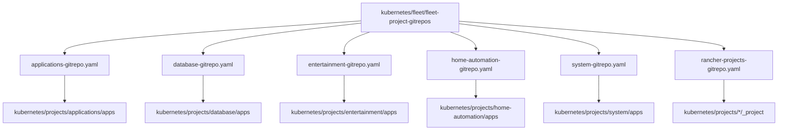
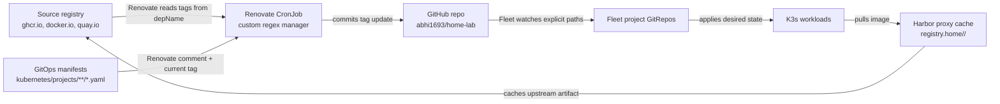

# Kubernetes Desired State

This directory owns the desired state that Rancher Fleet reconciles after the
Ansible bootstrap has created a working K3s cluster.

## What This Directory Owns

| Path | Purpose |
| --- | --- |
| `fleet/` | Fleet control-plane bundles and GitRepo resources. |
| `projects/` | Rancher project metadata and project-scoped app bundles. |
| `images/` | Custom image definitions, patches, and image documentation. |

## Why This Directory Exists

The bootstrap layer creates the cluster, but this directory defines what the
cluster continuously runs. It is the long-lived GitOps state for:

- system services such as monitoring, logging, tracing, DNS, backup, and
  compliance;
- shared platform services such as PostgreSQL, Valkey, and Harbor;
- public and internal applications;
- media and home automation workloads;
- project boundaries, namespace ownership, and app-level policy.

Fleet watches explicit paths and reconciles them into the cluster. This keeps
application operations separate from host bootstrap.

## How Fleet Reads This Tree

The Fleet control-plane bundle creates one GitRepo per major project. Each
GitRepo lists the app paths it owns:



This split matters because app projects have different dependencies and
different failure domains. A Database reconciliation problem should not hide in
the same bundle as a media app or a public web app.

## Bundle Shape

Most app directories follow this pattern:

| File | Role |
| --- | --- |
| `fleet.yaml` | Fleet bundle metadata, dependencies, and namespace defaults. |
| `deployment*.yaml` / `cronjob*.yaml` / `job*.yaml` | Workload definitions. |
| `service*.yaml` / `ingress*.yaml` | East-west service discovery and north-south entry points. |
| `networkpolicy*.yaml` / `*-cnp.yaml` | Allowed traffic paths. |
| `pvc*.yaml` / storage files | Persistent storage declarations. |
| `values.yaml` / `helmop.yaml` | Helm chart configuration through Fleet HelmOps. |
| `README.md` | App-specific purpose, dependencies, secrets, and operating notes. |

## HelmOps Pattern

For upstream Helm charts, this repo prefers a small GitOps wrapper bundle that
declares:

- the `HelmOp`;
- values in Git;
- supporting ConfigMaps or Kustomize configuration;
- network policies, dashboards, or extra resources around the chart.

This keeps chart installation declarative while preserving app-local context.

## Image Updates

Renovate owns image tag updates. Fleet owns reconciliation. Workloads pull from
Harbor proxy-cache paths in the cluster, while Renovate checks the upstream
registry named in the metadata comment.



Workloads that need explicit image update metadata carry Renovate comments next
to the image or tag value:

```yaml
# renovate: datasource=docker depName=ghcr.io/example-org/example-app
image: registry.home/ghcr.io/example-org/example-app:0.1.0
```

The `depName` is the registry/repository Renovate checks for available tags.
The image value is the path the cluster pulls, usually the same upstream path
prefixed by `registry.home/` so Harbor serves it from the local proxy cache.
App image pipelines should publish semver-style tags when Renovate is expected
to select newer versions.

## Operating Model

For normal changes:

1. Edit the owning app bundle under `kubernetes/projects/<project>/apps/<app>/`.
2. Validate locally or with server-side dry run when possible.
3. Commit and push.
4. Let Fleet reconcile the bundle.
5. Use read-only cluster inspection to diagnose convergence.

Avoid direct `kubectl apply`, `helm upgrade`, or manual patching unless it is a
deliberate break-glass action.
