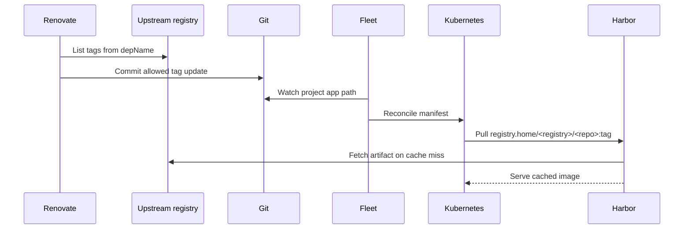

# Harbor

Fleet deploys Harbor with the official chart in the Applications project.

- chart: `harbor`
- chart repo: `https://helm.goharbor.io`
- status: active on ARM64 images published by `abhi1693/harbor`
- namespace: `harbor`
- public ingress: none
- local ingress: `http://registry.home` via Traefik
- registry storage: chart-managed Longhorn RWX PVC, `30Gi`
- PostgreSQL: `postgresql-pooler-harbor-rw.postgresql.svc.cluster.local`
- Valkey: `valkey.valkey.svc.cluster.local:26379` Sentinel set `valkey`

## ARM64 Images

The official `goharbor/*` component images for Harbor `v2.15.1` are amd64
single-manifest images. The Helm values override active Harbor components to
`ghcr.io/abhi1693/*` ARM64 images built from the upstream `goharbor/harbor`
tag by `github.com/abhi1693/harbor`.

## Required Secrets

Create these secrets before Fleet reconciles the Harbor HelmOp:

- `postgresql/harbor-postgresql-app` with key `password`
- `harbor/harbor-secrets` with keys `HARBOR_ADMIN_PASSWORD`, `password`, and
  `secretKey`

Harbor component secrets for core, jobservice, registry, registryctl, Trivy,
and token signing are left chart-managed so the values file does not need to
carry plaintext keys. The `password` value in `harbor/harbor-secrets` must
match `postgresql/harbor-postgresql-app`, and `secretKey` must be a stable
16-character value.

Harbor has one canonical `externalURL`; it is set to `http://registry.home` so
token service URLs stay local-only.

## Monitoring

Harbor exposes Prometheus metrics for exporter, core, jobservice, and registry
components on port `8001`. The Helm chart creates the `ServiceMonitor`, and the
Harbor network policy allows the Rancher Monitoring Prometheus pod in
`cattle-monitoring-system` to scrape those metrics.

Grafana auto-loads the upstream Harbor dashboard from the `harbor-dashboard`
ConfigMap in `cattle-dashboards`.

## Replication

Harbor is the local pull endpoint for cluster workloads. It keeps proxy-cache
projects for source registries such as `ghcr.io`, `docker.io`, `quay.io`, and
other registries mirrored by project path.

GitOps manifests keep the upstream path visible in Renovate metadata and use
the Harbor-prefixed path for the runtime image:

```yaml
# renovate: datasource=docker depName=ghcr.io/abhi1693/git-rank-backend
image: registry.home/ghcr.io/abhi1693/git-rank-backend:1.2.28
```

Renovate checks `ghcr.io/abhi1693/git-rank-backend` for newer tags. Kubernetes
pulls `registry.home/ghcr.io/abhi1693/git-rank-backend`, and Harbor fetches the
artifact from GHCR on cache miss. The same pattern applies to Docker Hub and
other configured proxy-cache projects.



## Retention

Retention policies are managed in Harbor:

- proxy cache projects such as `docker.io`, `ghcr.io`, and `quay.io`: retain
  artifacts pulled in the last 90 days.
- app projects: retain artifacts pulled in the last 90 days and the 20 most
  recently pushed artifacts per repository.

Retention runs daily at 23:00 UTC. The controller also keeps Harbor garbage
collection scheduled at 00:00 UTC with untagged artifact cleanup enabled, so
unreferenced blobs are reclaimed after retention has marked stale artifacts.
