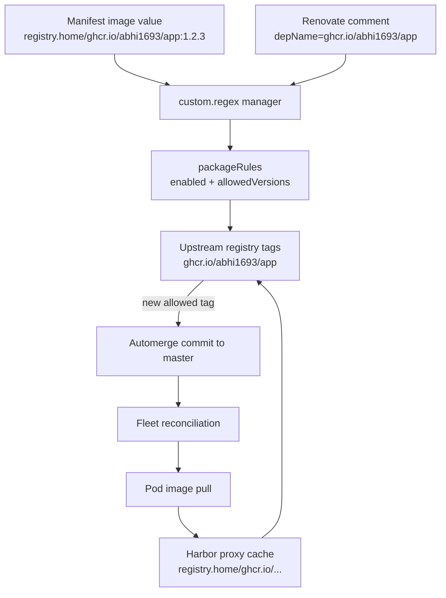

# Renovate

This bundle runs the official Renovate image as an hourly single-run CronJob in
the `renovate` namespace. It scans Kubernetes source files for explicit
Renovate comments, checks the upstream image registry for newer tags, and
commits allowed updates back to `master`.

Docker updates are disabled by default and re-enabled only for image names
listed in `packageRules`. Each package rule also defines the versioning scheme,
allowed version range, and branch automerge behavior for that image family.



The comment controls where Renovate looks for tags. The manifest image controls
where Kubernetes pulls from. For proxy-cache pulls, keep the upstream registry
in `depName` and prefix the runtime image with `registry.home/`, for example:

```yaml
# renovate: datasource=docker depName=ghcr.io/abhi1693/git-rank-backend
image: registry.home/ghcr.io/abhi1693/git-rank-backend:1.2.28
```

## Secrets

`secrets.sops.yaml` creates:

- `renovate`: `RENOVATE_TOKEN`, `HARBOR_USERNAME`, and `HARBOR_PASSWORD`
- `harbor-registry`: image pull credentials for `registry.home`

`RENOVATE_TOKEN` is used for GitHub API access, Git writes, and authenticated
GHCR lookups. Harbor credentials allow Renovate to inspect private
`registry.home` repositories when a package rule intentionally points at the
local registry.

## Adding Images

To add another automated image update:

1. Add a Renovate metadata comment next to the image, `imageName`, or `tag`
   value.
2. Use the upstream registry path in `depName` when the workload pulls through
   a Harbor proxy-cache path.
3. Add the image name to a matching `packageRules` entry.
4. Set an explicit `allowedVersions` range for the image.
5. Publish tags from the source repository in the version format selected by
   the package rule.
