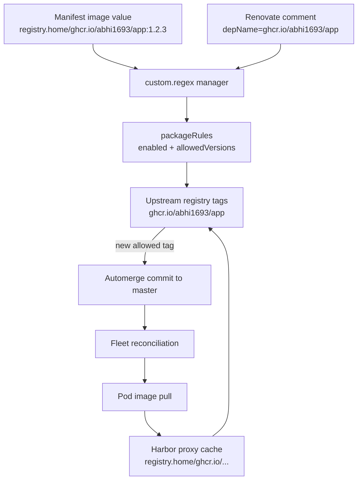

# Renovate

This bundle runs the official Renovate image as an hourly single-run CronJob in
the `renovate` namespace. It scans explicitly selected GitOps, Coder, image
build, GitHub Actions, Python requirements, and Ansible collection files for
updates. All enabled dependencies and lockfile maintenance use branch automerge
to update the default branch directly. Existing image version ranges and the
cluster-foundational exclusions still apply.

The shared policy sets `automerge: true`, `automergeType: "branch"`, and
`platformAutomerge: false`. `prCreation: "immediate"` allows branch automerge in
the same run that creates or rebases an update branch. Despite the option name,
successful branch automerge does not create a PR. Do not use `"approval"`,
`"not-pending"`, or `"status-success"`: Renovate 43.288.0 returns newly written
branches as pending before attempting automerge with those settings.
Renovate may create a fallback PR if the branch merge itself fails; inspect the
job logs in that case. `recreateWhen: "always"` allows
updates to proceed after obsolete review PRs are closed, instead of interpreting
those closures as instructions to ignore a version.

When migrating from review PRs, close the existing Renovate PRs without merging
them after Fleet has applied this policy. An open PR blocks branch automerge.
Renovate will re-evaluate those updates on its next hourly run.

The CronJob retains at most one failed Job and expires terminal Jobs after two
hours. Persistent hourly failures continue to produce a current failed Job,
while a recovered run no longer leaves `KubeJobFailed` alert noise for a day.

Docker updates are disabled by default and re-enabled only for native
Dockerfile dependencies or image and OCI-chart names listed in `packageRules`.
Each existing automated image rule also defines the versioning scheme, allowed
version range, and branch automerge behavior for that image family.
Wardn AI image pins are the exception: they use the `git-refs` datasource with
`currentValue=master` so Renovate can update full commit-SHA image tags that
Docker tag versioning ignores.


```mermaid
flowchart TD
  manifest["Manifest image value<br/>registry.home/ghcr.io/abhi1693/app:1.2.3"]
  comment["Renovate comment<br/>depName=ghcr.io/abhi1693/app"]
  regex["custom.regex manager"]
  rules["packageRules<br/>enabled + allowedVersions"]
  upstream["Upstream registry tags<br/>ghcr.io/abhi1693/app"]
  commit["Automerge commit to master"]
  fleet["Fleet reconciliation"]
  harbor["Harbor proxy cache<br/>registry.home/ghcr.io/..."]
  pod["Pod image pull"]

  manifest --> regex
  comment --> regex
  regex --> rules
  rules --> upstream
  upstream -->|new allowed tag| commit
  commit --> fleet
  fleet --> pod
  pod --> harbor
  harbor --> upstream
```

The comment controls where Renovate looks for tags. The manifest image controls
where Kubernetes pulls from. For proxy-cache pulls, keep the upstream registry
in `depName` and prefix the runtime image with `registry.home/`, for example:

```yaml
# renovate: datasource=docker depName=ghcr.io/abhi1693/shipyardhq
image: registry.home/ghcr.io/abhi1693/shipyardhq:1.5.13
```

## Secrets

`secrets.sops.yaml` creates:

- `renovate`: `RENOVATE_TOKEN`, `HARBOR_USERNAME`, and `HARBOR_PASSWORD`
- `harbor-registry`: image pull credentials for `registry.home`

`RENOVATE_TOKEN` is used for GitHub API access, Git writes, and authenticated
GHCR lookups. Harbor credentials allow Renovate to inspect private
`registry.home` repositories when a package rule intentionally points at the
local registry.

## Coverage and Safety Boundary

Renovate covers these non-foundational dependency types:

- explicitly annotated Kubernetes workload images and Fleet or HelmOp charts;
- Coder Dockerfiles, Terraform providers, modules, lock files, and published
  workspace image tags;
- GitHub Actions and release-pinned CI tools;
- Python CI requirements, NetBox image plugin requirements, and Ansible Galaxy
  collections; and
- Dockerfiles under `kubernetes/images/`.

Cluster-foundational dependencies are intentionally manual because their
upgrade requires coordinated bootstrap, compatibility, and recovery testing.
The exclusion includes K3s, kube-vip, Cilium and its CLI, CoreDNS, Metrics
Server, cert-manager, Rancher, Longhorn, MetalLB, CSI NFS, the embedded CNPG
operator chart, SOPS Secrets Operator, and Rancher system charts. Renovate must
not scan the Ansible `group_vars` that own the main platform pins.

`scripts/check-renovate-policy.py` enforces the ignored paths, rejects critical
package names and metadata, and requires literal non-critical GitOps images,
tags, and chart versions to carry Renovate metadata. Run it after changing
Renovate configuration or platform pins:

```sh
python scripts/check-renovate-policy.py
```

Some version sets remain manual even though they are not cluster-foundational.
The Valkey `helmop.yaml` chart pin requires a guarded `OnDelete` rollout, and
Rack Ops `secret-bootstrap.yaml` is a completed immutable Job whose name and
selector must advance together for a deliberate rerun. Both files are excluded
from scanning; their metadata still documents the upstream dependency.
The Jellyfin plugin bundle couples release URLs, checksums, ABI metadata, and
the generated metadata file. PyCharm and Portable Desktop pins likewise couple
versions, download URLs, and checksums. Native Renovate managers cannot safely
update those sets atomically, so they stay outside Renovate until a verified
generator is available.

## Adding Images

To add another automated image update:

1. Add a Renovate metadata comment next to the image, `imageName`, or `tag`
   value.
2. Use the upstream registry path in `depName` when the workload pulls through
   a Harbor proxy-cache path.
3. Add the image name to a matching `packageRules` entry.
4. Set an explicit `allowedVersions` range for the image.
5. Publish tags from the source repository in the version format selected by
   the package rule.

Do not add Renovate metadata to a critical path or dependency. If a dependency
needs multiple coupled file or checksum changes, add a deterministic generator
and validation before enrolling it.

For full commit-SHA image tags, use the `git-refs` form instead of the Docker
datasource:

```yaml
# renovate: datasource=git-refs depName=https://github.com/abhi1693/wardn-ai currentValue=master
image: registry.home/ghcr.io/abhi1693/wardn-ai-backend:<40-character-sha>
```
