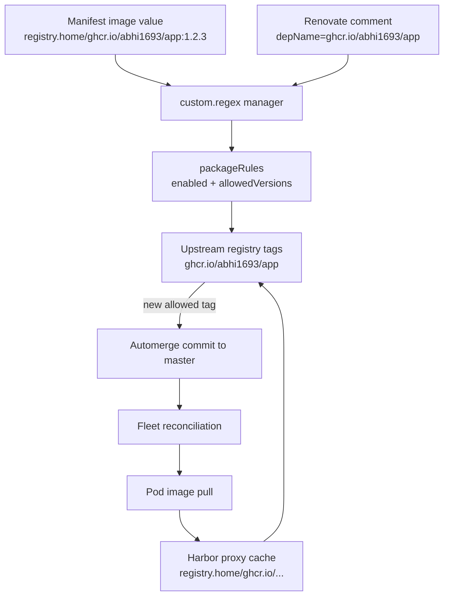

# Renovate

This bundle runs the official Renovate image as an hourly single-run CronJob in
the `renovate` namespace. It scans Kubernetes source files for explicit
Renovate comments, checks the upstream image registry for newer tags, and
commits allowed updates back to `master`.

The CronJob retains at most one failed Job and expires terminal Jobs after two
hours. Persistent hourly failures continue to produce a current failed Job,
while a recovered run no longer leaves `KubeJobFailed` alert noise for a day.

Docker updates are disabled by default and re-enabled only for image names
listed in `packageRules`. Each package rule also defines the versioning scheme,
allowed version range, and branch automerge behavior for that image family.
Wardn AI image pins are the exception: they use the `git-refs` datasource with
`currentValue=master` so Renovate can update full commit-SHA image tags that
Docker tag versioning ignores.


```mermaid
flowchart TD
  manifest["Manifest image value<br/>registry.home/ghcr.io/abhi1693/app:1.2.3"]
  comment["Renovate comment<br/>depName=ghcr.io/abhi1693/app"]
  regex["custom.regex manager"]
  rules["packageRules<br/>enabled + allowedVersions"]
  upstream["Upstream registry tags<br/>ghcr.io/abhi1693/app"]
  commit["Automerge commit to master"]
  fleet["Fleet reconciliation"]
  harbor["Harbor proxy cache<br/>registry.home/ghcr.io/..."]
  pod["Pod image pull"]

  manifest --> regex
  comment --> regex
  regex --> rules
  rules --> upstream
  upstream -->|new allowed tag| commit
  commit --> fleet
  fleet --> pod
  pod --> harbor
  harbor --> upstream
```

The comment controls where Renovate looks for tags. The manifest image controls
where Kubernetes pulls from. For proxy-cache pulls, keep the upstream registry
in `depName` and prefix the runtime image with `registry.home/`, for example:

```yaml
# renovate: datasource=docker depName=ghcr.io/abhi1693/shipyardhq
image: registry.home/ghcr.io/abhi1693/shipyardhq:1.5.13
```

## Secrets

`secrets.sops.yaml` creates:

- `renovate`: `RENOVATE_TOKEN`, `HARBOR_USERNAME`, and `HARBOR_PASSWORD`
- `harbor-registry`: image pull credentials for `registry.home`

`RENOVATE_TOKEN` is used for GitHub API access, Git writes, and authenticated
GHCR lookups. Harbor credentials allow Renovate to inspect private
`registry.home` repositories when a package rule intentionally points at the
local registry.

## Adding Images

To add another automated image update:

1. Add a Renovate metadata comment next to the image, `imageName`, or `tag`
   value.
2. Use the upstream registry path in `depName` when the workload pulls through
   a Harbor proxy-cache path.
3. Add the image name to a matching `packageRules` entry.
4. Set an explicit `allowedVersions` range for the image.
5. Publish tags from the source repository in the version format selected by
   the package rule.

For full commit-SHA image tags, use the `git-refs` form instead of the Docker
datasource:

```yaml
# renovate: datasource=git-refs depName=github.com/abhi1693/wardn-ai currentValue=master
image: registry.home/ghcr.io/abhi1693/wardn-ai-backend:<40-character-sha>
```
