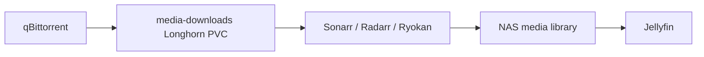

# Entertainment Project

The Entertainment project owns the media stack. It combines upstream Helm
charts, raw Kubernetes manifests, shared storage, app network policy, and custom
automation into one Fleet-managed media domain.

Fleet tracks this project through the `home-lab-entertainment` GitRepo.

## Why This Project Exists

Media workloads have a different operational profile from public web apps:

- they share large storage volumes;
- they have long-running imports and background jobs;
- some services need LAN or peer-to-peer exposure;
- several apps depend on each other through API integrations;
- partial downloads must be kept away from completed libraries;
- ARM64 chart and image choices matter.

Keeping the media stack in its own Rancher project makes those assumptions
visible and keeps media-specific network and storage policies away from other
apps.

## App Catalog

| App | What it does | Key coupling |
| --- | --- | --- |
| `media-storage` | Owns the `media` namespace, NAS-backed completed library PVC, downloads PVC, and keeper pod. | Longhorn downloads, NAS NFS completed library. |
| `media-qbittorrent` | Torrent client and smart queue automation. | LoadBalancer peer port, downloads PVC, tracker refresh, rack automation. |
| `media-prowlarr` | Indexer manager. | qBittorrent, Sonarr, Radarr, FlareSolverr, optional proxy. |
| `media-sonarr` | TV library automation. | Prowlarr, qBittorrent, completed media PVC. |
| `media-radarr` | Movie library automation. | Prowlarr, qBittorrent, completed media PVC. |
| `media-ryokan` | Anime request/import workflow. | qBittorrent anime category, NAS anime library. |
| `media-shoko` | Anime metadata and library management. | NAS anime library, Jellyfin/Shokofin workflow. |
| `media-jellyfin` | Media server. | NAS media library, custom image, PostgreSQL experiment, shared metadata PVCs. |
| `media-jellyseerr` | Media request portal. | Jellyfin and media app APIs. |
| `media-metube` | yt-dlp browser UI for YouTube library ingestion. | YouTube library paths consumed by Jellyfin. |
| `media-profilarr` | Profile/config management for media apps. | App API credentials and media app configuration. |
| `media-dispatcharr` | IPTV/dispatch workflow. | PostgreSQL and media network policies. |
| `media-flaresolverr` | Browser challenge helper for indexers. | Prowlarr indexer proxy. |
| `media-do-squid-firewall` | Keeps a remote Squid proxy allowlist aligned with cluster egress. | Public indexer proxy path. |
| `media-helm-repositories` | Registers Helm repositories for media charts. | Rancher ClusterRepo. |

## Storage Flow

Downloads and completed media are intentionally separate.

This avoids Jellyfin scanning partial downloads and keeps the final media
library on NAS-backed storage. Sonarr, Radarr, and Ryokan import completed
downloads into the final library. Jellyfin and metadata tools read from the
completed library.

## Traffic Flow

- Browser UIs use Traefik ingress on internal hostnames such as
  `sonarr.media.home`, `radarr.media.home`, and `watch.media.home`.
- qBittorrent uses a Cilium LoadBalancer service for torrent peer traffic.
- Media apps communicate east-west through ClusterIP services.
- Network policies limit ingress to Traefik, monitoring, and approved app
  peers.
- Indexer traffic can use FlareSolverr or an explicit proxy path when needed.

## Operating Notes

- Keep credentials and app API keys out of Git.
- Keep Prowlarr as the indexer source of truth for normal TV/movie apps.
- Keep completed libraries and download scratch space separate.
- Treat qBittorrent LoadBalancer exposure as a deliberate exception to the
  normal HTTP ingress model.
- Use the app-level README files for detailed wiring and first-run steps.
