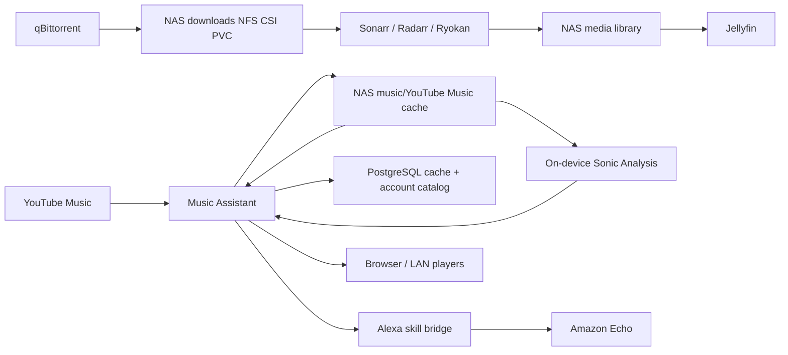

# Entertainment Project

The Entertainment project owns the media stack. It combines upstream Helm
charts, raw Kubernetes manifests, shared storage, app network policy, and custom
automation into one Fleet-managed media domain.

Fleet tracks this project through the `home-lab-entertainment` GitRepo.

## Why This Project Exists

Media workloads have a different operational profile from public web apps:

- they share large storage volumes;
- they have long-running imports and background jobs;
- some services need LAN or peer-to-peer exposure;
- several apps depend on each other through API integrations;
- partial downloads must be kept away from completed libraries;
- ARM64 chart and image choices matter.

Keeping the media stack in its own Rancher project makes those assumptions
visible and keeps media-specific network and storage policies away from other
apps.

## App Catalog

| App | What it does | Key coupling |
| --- | --- | --- |
| `media-storage` | Owns the `media` namespace and the NAS-backed completed-library and downloads PVCs. | NFS CSI and existing NAS exports. |
| `media-qbittorrent` | Torrent client and smart queue automation. | LoadBalancer peer port, downloads PVC, tracker refresh, rack automation. |
| `media-prowlarr` | Indexer manager. | qBittorrent, Sonarr, Radarr, FlareSolverr, optional proxy. |
| `media-sonarr` | TV library automation. | Prowlarr, qBittorrent, completed media PVC. |
| `media-radarr` | Movie library automation. | Prowlarr, qBittorrent, completed media PVC. |
| `media-music-assistant` | Authenticated YouTube Music account mirror, persistent local playback cache, local audio-similarity radio, HTTPS PWA, MCP access, and playback. | Hash-pinned YouTube Music provider, SOPS-fed account cookie, PostgreSQL cache catalog, NAS music storage, Sonic Analysis, Last.fm, host-network players. |
| `media-music-assistant-alexa-skill` | Alexa custom-skill bridge for Music Assistant playback. | Amazon Developer authorization, public skill endpoint, public port `8097` stream route, retained ASK credentials. |
| `media-ryokan` | Anime request/import workflow. | qBittorrent anime category, NAS anime library, controlled Squid HTTPS egress. |
| `media-shoko` | Anime metadata and library management. | NAS anime library, Jellyfin/Shokofin workflow. |
| `media-jellyfin` | Media server. | NAS media library, custom image, PostgreSQL experiment, shared metadata PVCs. |
| `media-jellyseerr` | Media request portal. | Jellyfin and media app APIs. |
| `media-flaresolverr` | Browser challenge helper for indexers. | Prowlarr indexer proxy. |
| `media-do-squid-firewall` | Keeps a remote Squid proxy allowlist aligned with cluster egress. | Public indexer proxy path. |
| `media-helm-repositories` | Registers Helm repositories for media charts. | Rancher ClusterRepo. |

## Storage Flow

Downloads and completed media are intentionally separate.

```mermaid
flowchart LR
  qbittorrent["qBittorrent"]
  downloads["NAS downloads NFS CSI PVC"]
  importers["Sonarr / Radarr / Ryokan"]
  library["NAS media library"]
  jellyfin["Jellyfin"]
  ytmusic["YouTube Music"]
  musicAssistant["Music Assistant"]
  cache["NAS music/YouTube Music cache"]
  catalog["PostgreSQL cache + account catalog"]
  sonic["On-device Sonic Analysis"]
  alexaSkill["Alexa skill bridge"]
  echo["Amazon Echo"]
  players["Browser / LAN players"]

  qbittorrent --> downloads
  downloads --> importers
  importers --> library
  library --> jellyfin
  ytmusic --> musicAssistant
  musicAssistant --> cache
  musicAssistant --> catalog
  cache --> musicAssistant
  cache --> sonic
  sonic --> musicAssistant
  musicAssistant --> players
  musicAssistant --> alexaSkill
  alexaSkill --> echo
```

This avoids Jellyfin scanning partial downloads and keeps the final media
library on NAS-backed NFS CSI storage. Sonarr, Radarr, and Ryokan import completed
downloads into the final library. Jellyfin and metadata tools read from the
completed library.

Music Assistant owns the music path directly. Its authenticated YouTube Music
provider mirrors the account library, likes, playlists, uploads, subscriptions,
and the history window that YouTube exposes. Playback can begin from YouTube
while a background task stores an atomic local copy under
`music/YouTube Music`; later plays use that file without downloading it again.
Production permits up to three paced yt-dlp track downloads at once. The
PostgreSQL catalog records account snapshots, queue state, file paths, and
quality metadata. Every prefetch run reconciles the database with the
filesystem, requeues missing files, and upgrades cached audio when YouTube
offers a better authenticated format.

The common music tree remains available to Music Assistant for local playback
and Sonic Analysis. The retired applications' old `music/Lidarr`,
`music/Aurral`, and `downloads/slskd` directories are retained on NFS as
operator-owned data; removing their Kubernetes workloads does not delete those
shared-export paths.

## Traffic Flow

- Browser UIs use Traefik ingress on internal hostnames such as
  `sonarr.media.home`, `radarr.media.home`, `requests.music.media.home`, and
  `watch.media.home`.
- Music Assistant uses the Home Lab Local CA at `https://music.media.home`;
  HTTP redirects to HTTPS so WebRTC and MCP credential exchange have a secure
  browser context.
- qBittorrent requests the fixed MetalLB Layer 2 VIP `192.168.3.16` for torrent
  peer traffic.
- Music Assistant uses host networking on `k8s-rpi4` so multicast discovery,
  player protocols, and stream ports remain on the LAN. Traefik serves its PWA
  at `music.media.home`.
- Alexa playback uses `alexa.abhimanyu-saharan.com` for Amazon's public
  custom-skill callback and `music-stream.abhimanyu-saharan.com` for transient
  player streams. The Music Assistant server itself remains private.
- Media apps communicate east-west through ClusterIP services.
- Network policies limit ingress to Traefik, monitoring, and approved app
  peers.
- Indexer traffic can use FlareSolverr or an explicit proxy path when needed.
- Ryokan uses the controlled Squid path for external HTTPS so direct Nyaa
  searches do not depend on the home ISP route.

## Operating Notes

- Keep credentials and app API keys out of Git.
- Keep Prowlarr as the indexer source of truth for normal TV/movie apps.
- Keep completed libraries and download scratch space separate.
- Use Music Assistant for account discovery, playback, persistent YouTube
  caching, and seed-based radio across online and local sources.
- Use YouTube acquisition only for material the operator is authorized to
  download; expect cookie or trusted-session maintenance when bot detection is
  triggered.
- The Music Assistant YouTube Music source uses an unofficial internal API and
  an encrypted cookie from its own SOPS-managed Secret. Its
  source commit, unchanged source file hashes, and package versions are pinned;
  expect cookie rotation and provider maintenance when YouTube changes
  behavior.
- The Alexa bridge is a pinned third-party beta. Keep ASK credentials on its
  retained PVC and complete its interactive `/setup` flow after first rollout.
- Treat qBittorrent LoadBalancer exposure as a deliberate exception to the
  normal HTTP ingress model.
- Use the app-level README files for detailed wiring and first-run steps.
